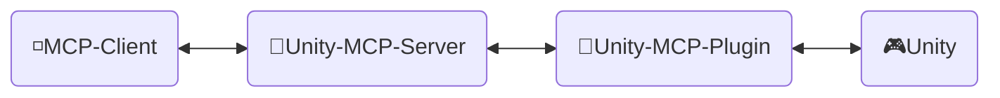
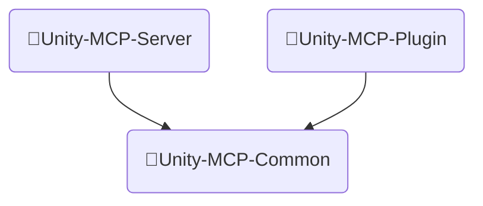
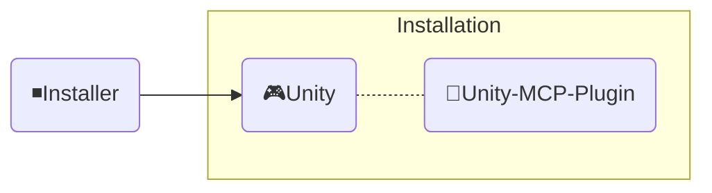

<div align="center" width="100%">
  <h1>🛠️ Desarrollo ─ AI Game Developer</h1>

[](https://modelcontextprotocol.io/introduction)
[](https://openupm.com/packages/com.ivanmurzak.unity.mcp/)
[](https://hub.docker.com/r/ivanmurzakdev/unity-mcp-server)
[](https://unity.com/releases/editor/archive)
[](https://unity.com/releases/editor/archive)
[](https://github.com/IvanMurzak/Unity-MCP/actions/workflows/release.yml)</br>
[](https://discord.gg/cfbdMZX99G)
[](https://github.com/IvanMurzak/Unity-MCP/stargazers)
[](https://github.com/IvanMurzak/Unity-MCP/blob/main/LICENSE)
[](https://stand-with-ukraine.pp.ua)

  <b>[English](https://github.com/IvanMurzak/Unity-MCP/blob/main/docs/dev/Development.md) | [日本語](https://github.com/IvanMurzak/Unity-MCP/blob/main/docs/dev/Development.ja.md) | [中文](https://github.com/IvanMurzak/Unity-MCP/blob/main/docs/dev/Development.zh-CN.md)</b>

</div>

**Visión**

Creemos que la IA será (si no lo es ya) una parte importante del desarrollo de juegos. Existen interfaces de IA increíbles como `Claude`, `Copilot`, `Cursor` y muchas otras. Proporcionan agentes y funciones sorprendentes y, lo más importante, siguen mejorando. Estos proyectos tienen presupuestos enormes y probablemente serán las mejores plataformas de IA para profesionales. Conectamos el desarrollo de juegos con estas herramientas, este proyecto funciona en conjunto con ellas, no en su contra. Creceremos con ellas. Por eso este proyecto no implementará una ventana de chat aislada interna. Queremos construir una solución simple y elegante que se convierta en la base de los sistemas de IA en el desarrollo de juegos con el ecosistema de Unity Engine.

**Objetivos del proyecto**

- Ofrecer una solución de desarrollo de juegos con IA de alta calidad **gratis** para todos
- Proporcionar una plataforma altamente personalizable para que los desarrolladores de juegos puedan adaptar las funciones de IA a sus necesidades
- Permitir utilizar los mejores instrumentos de IA para el desarrollo de juegos, todo en un solo lugar
- Mantener y dar soporte a tecnologías de IA de vanguardia para el desarrollo de juegos, especialmente en Unity Engine y más allá del motor

**Contribuir**

Cualquier contribución al proyecto es muy apreciada. Por favor, sigue este documento para ver nuestros objetivos, visión y estructura del proyecto. Todo esto debería ayudarte a participar en la nueva era tecnológica del desarrollo de juegos.

**Este documento**

Este documento explica la estructura interna del proyecto, diseño, estilo de código y principios principales. Por favor úsalo si eres un colaborador o si te gustaría entender el proyecto en profundidad.

> **[💬 Únete a nuestro servidor de Discord](https://discord.gg/cfbdMZX99G)** - ¡Haz preguntas, muestra tu trabajo y conéctate con otros desarrolladores!

## Contenido

- [Contribuir](#contribuir)
- [Estructura de proyectos](#estructura-de-proyectos)
  - [🔹Unity-MCP-Server](#unity-mcp-server)
    - [Imagen Docker](#imagen-docker)
  - [🔸Unity-MCP-Plugin](#unity-mcp-plugin)
    - [Paquete UPM](#paquete-upm)
    - [Editor](#editor)
    - [Runtime](#runtime)
    - [Funciones MCP](#funciones-mcp)
      - [Agregar `MCP Tool`](#agregar-mcp-tool)
      - [Agregar `MCP Prompt`](#agregar-mcp-prompt)
  - [🔺Unity-MCP-Common](#unity-mcp-common)
  - [◾Installer (Unity)](#installer-unity)
- [Estilo de código](#estilo-de-código)
- [CI/CD](#cicd)
  - [Resumen de flujos de trabajo](#resumen-de-flujos-de-trabajo)
    - [🚀 release.yml](#-releaseyml)
    - [🧪 test\_pull\_request.yml](#-test_pull_requestyml)
    - [🔧 test\_unity\_plugin.yml](#-test_unity_pluginyml)
    - [📦 deploy.yml](#-deployyml)
    - [🎯 deploy\_server\_executables.yml](#-deploy_server_executablesyml)
  - [Stack tecnológico](#stack-tecnológico)
  - [Consideraciones de seguridad](#consideraciones-de-seguridad)
  - [Destinos de despliegue](#destinos-de-despliegue)

# Contribuir

Construyamos juntos el brillante futuro del desarrollo de juegos, contribuye al proyecto. Usa este documento para entender la estructura del proyecto y cómo funciona exactamente.

1. [Haz un fork del proyecto](https://github.com/IvanMurzak/Unity-MCP/fork)
2. Realiza tus mejoras, sigue el estilo de código
3. [Crea un Pull Request](https://github.com/IvanMurzak/Unity-MCP/compare)

# Estructura de proyectos



◽**MCP Client** - Cualquier interfaz de IA como: *Claude*, *Copilot*, *Cursor* o cualquier otra, no es parte de este proyecto, pero es un elemento importante de la arquitectura.

🔹**Unity-MCP-Server** - `MCP Server` que se conecta a `MCP Client` y opera con él. El mismo `Unity-MCP-Server` se comunica con `Unity-MCP-Plugin` a través de SignalR. Puede ejecutarse localmente o en la nube con transporte HTTP. Stack tecnológico: `C#`, `ASP.NET Core`, `SignalR`

🔸**Unity-MCP-Plugin** - `Unity Plugin` que se integra en un proyecto Unity, tiene acceso a la API de Unity. Se comunica con `Unity-MCP-Server` y ejecuta comandos desde el servidor. Stack tecnológico: `C#`, `Unity`, `SignalR`

🎮**Unity** - Unity Engine, motor de juegos.

---

## 🔹Unity-MCP-Server

Una aplicación C# ASP.NET Core que actúa como puente entre clientes MCP (interfaces de IA como Claude, Cursor) e instancias de Unity Editor. El servidor implementa el [Model Context Protocol](https://github.com/modelcontextprotocol) usando el [csharp-sdk](https://github.com/modelcontextprotocol/csharp-sdk).

> Ubicación del proyecto: `Unity-MCP-Server`

**Responsabilidades principales:**

1. **Implementación del protocolo MCP** ([ExtensionsMcpServer.cs](Unity-MCP-Server/src/Extension/ExtensionsMcpServer.cs))
   - Implementa servidor MCP con soporte para Tools, Prompts y Resources
   - Soporta métodos de transporte STDIO y HTTP
   - Maneja solicitudes de clientes MCP: `CallTool`, `GetPrompt`, `ReadResource` y sus operaciones de lista
   - Envía notificaciones a clientes MCP cuando las capacidades cambian (actualizaciones de lista de tool/prompt)

2. **Comunicación SignalR Hub** ([RemoteApp.cs](Unity-MCP-Server/src/Hub/RemoteApp.cs), [BaseHub.cs](Unity-MCP-Server/src/Hub/BaseHub.cs))
   - Gestiona comunicación bidireccional en tiempo real con Unity-MCP-Plugin vía SignalR
   - Maneja handshake de versión para asegurar compatibilidad de API entre servidor y plugin
   - Rastrea conexiones de clientes y gestiona desconexiones
   - Enruta notificaciones de actualizaciones de tool/prompt/resource desde Unity a clientes MCP

3. **Enrutamiento y ejecución de solicitudes** ([ToolRouter.Call.cs](Unity-MCP-Server/src/Routing/Tool/ToolRouter.Call.cs), [PromptRouter.Get.cs](Unity-MCP-Server/src/Routing/Prompt/PromptRouter.Get.cs), [ResourceRouter.ReadResource.cs](Unity-MCP-Server/src/Routing/Resource/ResourceRouter.ReadResource.cs))
   - Enruta solicitudes de clientes MCP a la instancia apropiada de Unity-MCP-Plugin
   - Maneja llamadas de Tool, solicitudes de Prompt y lecturas de Resource
   - Realiza manejo de errores y validación
   - Convierte entre formatos de protocolo MCP y modelos de datos internos

4. **Servicio de ejecución remota** ([RemoteToolRunner.cs](Unity-MCP-Server/src/Client/RemoteToolRunner.cs), [RemotePromptRunner.cs](Unity-MCP-Server/src/Client/RemotePromptRunner.cs), [RemoteResourceRunner.cs](Unity-MCP-Server/src/Client/RemoteResourceRunner.cs))
   - Invoca procedimientos remotos en Unity-MCP-Plugin a través de SignalR
   - Rastrea solicitudes asíncronas y gestiona timeouts
   - Implementa patrones de solicitud/respuesta con soporte de cancelación
   - Maneja callbacks de finalización de solicitudes desde instancias de Unity

5. **Gestión del ciclo de vida del servidor** ([Program.cs](Unity-MCP-Server/src/Program.cs), [McpServerService.cs](Unity-MCP-Server/src/McpServerService.cs))
   - Configura e inicia servidor web ASP.NET Core con Kestrel
   - Inicializa servidor MCP, hub SignalR e inyección de dependencias
   - Gestiona logging con NLog (redirige logs a stderr en modo STDIO)
   - Maneja apagado graceful y limpieza de recursos
   - Se suscribe a eventos de cambio de lista de tool/prompt de Unity

### Imagen Docker

`Unity-MCP-Server` es desplegable en una imagen docker. Contiene archivos `Dockerfile` y `.dockerignore` en la carpeta del proyecto.

---

## 🔸Unity-MCP-Plugin

Se integra en el entorno de Unity. Usa `Unity-MCP-Common` para buscar MCP *Tool*, *Resource* y *Prompt* en el código base local usando reflection. Se comunica con `Unity-MCP-Server` para enviar actualizaciones sobre MCP *Tool*, *Resource* y *Prompt*. Toma comandos de `Unity-MCP-Server` y los ejecuta.

> Ubicación del proyecto: `Unity-MCP-Plugin`

### Paquete UPM

`Unity-MCP-Plugin` es un paquete UPM, la carpeta raíz del paquete está ubicada en . Contiene `package.json`. El cual se usa para subir el paquete directamente desde la release de GitHub a [OpenUPM](https://openupm.com/).

> Ubicación `Unity-MCP-Plugin/Assets/root`

### Editor

El componente Editor proporciona integración con Unity Editor, implementando capacidades MCP (Tools, Prompts, Resources) y gestionando el ciclo de vida de `Unity-MCP-Server`.

> Ubicación `Unity-MCP-Plugin/Assets/root/Editor`

**Responsabilidades principales:**

1. **Gestión del ciclo de vida del plugin** ([Startup.cs](../../Unity-MCP-Plugin/Assets/root/Editor/Scripts/Startup.cs))
   - Auto-inicialización al cargar Unity Editor vía `[InitializeOnLoad]`
   - Gestiona persistencia de conexión a través de eventos del ciclo de vida del Editor (recarga de ensamblados, transiciones de modo Play)
   - Reconexión automática después de recarga de dominio o salida del modo Play

2. **Gestión de binarios del servidor MCP** ([Startup.Server.cs](../../Unity-MCP-Plugin/Assets/root/Editor/Scripts/Startup.Server.cs))
   - Descarga y gestiona el ejecutable `Unity-MCP-Server` desde releases de GitHub
   - Selección de binarios multiplataforma (Windows/macOS/Linux, x86/x64/ARM/ARM64)
   - Aplicación de compatibilidad de versiones entre servidor y plugin
   - Generación de configuración para clientes MCP (JSON con rutas de ejecutables y configuración de conexión)

3. **Implementación de API MCP** ([Scripts/API/](../../Unity-MCP-Plugin/Assets/root/Editor/Scripts/API/))
   - **Tools** (50+): GameObject, Scene, Assets, Prefabs, Scripts, Components, Editor Control, Test Runner, Console, Reflection
   - **Prompts**: Plantillas predefinidas para tareas comunes de desarrollo en Unity
   - **Resources**: Acceso basado en URI a datos de Unity Editor con serialización JSON
   - Todas las operaciones se ejecutan en el hilo principal de Unity para seguridad de hilos
   - Descubrimiento basado en atributos usando `[McpPluginTool]`, `[McpPluginPrompt]`, `[McpPluginResource]`

4. **UI del Editor** ([Scripts/UI/](../../Unity-MCP-Plugin/Assets/root/Editor/Scripts/UI/))
   - Ventana de configuración para gestión de conexión (`Window > AI Game Developer`)
   - Gestión de binarios del servidor y acceso a logs vía elementos del menú de Unity

### Runtime

El componente Runtime proporciona infraestructura central compartida entre modos Editor y Runtime, manejando comunicación SignalR, serialización y acceso thread-safe a la API de Unity.

> Ubicación `Unity-MCP-Plugin/Assets/root/Runtime`

**Responsabilidades principales:**

1. **Core del plugin y conexión SignalR** ([UnityMcpPlugin.cs](../../Unity-MCP-Plugin/Assets/root/Runtime/UnityMcpPlugin.cs))
   - Singleton thread-safe que gestiona el ciclo de vida del plugin vía `BuildAndStart()`
   - Descubre MCP Tools/Prompts/Resources desde ensamblados usando reflection
   - Establece conexión SignalR a Unity-MCP-Server con monitoreo reactivo de estado (librería R3)
   - Gestión de configuración: host, puerto, timeout, compatibilidad de versión

2. **Dispatcher del hilo principal** ([MainThreadDispatcher.cs](../../Unity-MCP-Plugin/Assets/root/Runtime/Utils/MainThreadDispatcher.cs))
   - Organiza llamadas a la API de Unity desde hilos en segundo plano de SignalR al hilo principal de Unity
   - Ejecución basada en cola en el bucle Update de Unity
   - Crítico para la ejecución thread-safe de operaciones MCP

3. **Serialización de tipos de Unity** ([ReflectionConverters/](../../Unity-MCP-Plugin/Assets/root/Runtime/ReflectionConverters/), [JsonConverters/](../../Unity-MCP-Plugin/Assets/root/Runtime/JsonConverters/))
   - Serialización JSON personalizada para tipos de Unity (GameObject, Component, Transform, Vector3, Quaternion, etc.)
   - Convierte objetos de Unity a formato de referencia (`GameObjectRef`, `ComponentRef`) con seguimiento de instanceID
   - Se integra con ReflectorNet para introspección de objetos y serialización de componentes
   - Proporciona esquemas JSON para definiciones de tipos del protocolo MCP

4. **Logging y diagnósticos** ([Logger/](../../Unity-MCP-Plugin/Assets/root/Runtime/Logger/), [Unity/Logs/](../../Unity-MCP-Plugin/Assets/root/Runtime/Unity/Logs/))
   - Conecta Microsoft.Extensions.Logging a Unity Console con niveles codificados por colores
   - Recopila logs de Unity Console para recuperación de contexto de IA vía MCP Tools

### Funciones MCP

#### Agregar `MCP Tool`

```csharp
[McpPluginToolType]
public class Tool_GameObject
{
    [McpPluginTool
    (
        "MyCustomTask",
        Title = "Create a new GameObject"
    )]
    [Description("Explica aquí al LLM qué es esto, cuándo debería ser llamado.")]
    public string CustomTask
    (
        [Description("Explica al LLM qué es esto.")]
        string inputData
    )
    {
        // haz cualquier cosa en hilo secundario

        return MainThread.Instance.Run(() =>
        {
            // haz algo en el hilo principal si es necesario

            return $"[Success] Operación completada.";
        });
    }
}
```

#### Agregar `MCP Prompt`

`MCP Prompt` te permite inyectar prompts personalizados en la conversación con el LLM. Soporta dos roles de emisor: User y Assistant. Esta es una forma rápida de instruir al LLM para realizar tareas específicas. Puedes generar prompts usando datos personalizados, proporcionando listas o cualquier otra información relevante.

```csharp
[McpPluginPromptType]
public static class Prompt_ScriptingCode
{
    [McpPluginPrompt(Name = "add-event-system", Role = Role.User)]
    [Description("Implementar sistema de comunicación basado en UnityEvent entre GameObjects.")]
    public string AddEventSystem()
    {
        return "Crear sistema de eventos usando UnityEvents, UnityActions o delegados de eventos personalizados para comunicación desacoplada entre sistemas de juego y componentes.";
    }
}
```

---

## 🔺Unity-MCP-Common



**Unity-MCP-Common** - base de código compartido entre `Unity-MCP-Server` y `Unity-MCP-Plugin`. Es necesario para simplificar el modelo de datos y el compartir API entre proyectos. Es un proyecto de librería dotnet independiente.

> Ubicación del proyecto: `Unity-MCP-Plugin/Assets/root/Unity-MCP-Common`

---

## ◾Installer (Unity)



**Installer** instala `Unity-MCP-Plugin` y dependencias como paquetes NPM en un proyecto Unity.

> Ubicación del proyecto: `Installer`

---

# Estilo de código

Este proyecto sigue patrones de codificación C# consistentes. A continuación se muestra un ejemplo completo que demuestra las convenciones clave:

```csharp
/*
┌──────────────────────────────────────────────────────────────────┐
│  Author: Ivan Murzak (https://github.com/IvanMurzak)             │
│  Repository: GitHub (https://github.com/IvanMurzak/Unity-MCP)    │
│  Copyright (c) 2025 Ivan Murzak                                  │
│  Licensed under the Apache License, Version 2.0.                 │
│  See the LICENSE file in the project root for more information.  │
└──────────────────────────────────────────────────────────────────┘
*/

// Habilitar tipos de referencia nullable para mejor seguridad de null
#nullable enable

// Compilación condicional para código específico de plataforma
#if UNITY_EDITOR
using UnityEditor;
#endif

using System;
using System.ComponentModel;
using System.Threading.Tasks;
using com.IvanMurzak.Unity.MCP.Common;
using com.IvanMurzak.Unity.MCP.Utils;
using UnityEngine;

namespace com.IvanMurzak.Unity.MCP.Editor.API
{
    // Usar [McpPluginToolType] para clases de herramientas - habilita descubrimiento MCP vía reflection
    [McpPluginToolType]
    // Las clases parciales permiten dividir la implementación en múltiples archivos
    // Patrón: Un archivo por operación (ej. GameObject.Create.cs, GameObject.Destroy.cs)
    public partial class Tool_GameObject
    {
        // La clase Error anidada centraliza mensajes de error para mantenibilidad
        public static class Error
        {
            // Métodos estáticos para formato consistente de errores
            public static string GameObjectNameIsEmpty()
                => "[Error] El nombre del GameObject está vacío. Por favor proporciona un nombre válido.";

            public static string NotFoundGameObjectAtPath(string path)
                => $"[Error] GameObject '{path}' no encontrado.";
        }

        // Declaración de MCP Tool con metadatos basados en atributos
        [McpPluginTool(
            "GameObject_Create",                    // Identificador único de herramienta
            Title = "Create a new GameObject"       // Título legible para humanos
        )]
        // El atributo Description guía a la IA sobre cuándo/cómo usar esta herramienta
        [Description(@"Crear un nuevo GameObject en la escena.
Proporciona posición, rotación y escala para minimizar operaciones subsecuentes.")]
        public string Create
        (
            // Las descripciones de parámetros ayudan a la IA a entender las entradas esperadas
            [Description("Nombre del nuevo GameObject.")]
            string name,

            [Description("Referencia del GameObject padre. Si no se proporciona, se crea en la raíz de la escena.")]
            GameObjectRef? parentGameObjectRef = null,  // Nullable con valor predeterminado

            [Description("Posición del Transform del GameObject.")]
            Vector3? position = null,                    // Struct de Unity, nullable

            [Description("Rotación del Transform en ángulos de Euler (grados).")]
            Vector3? rotation = null,

            [Description("Escala del Transform del GameObject.")]
            Vector3? scale = null
        )
        // Sintaxis de expresión lambda para ejecución inmediata en hilo principal
        => MainThread.Instance.Run(() =>           // Todas las llamadas a la API de Unity DEBEN ejecutarse en el hilo principal
        {
            // Validar parámetros de entrada temprano
            if (string.IsNullOrEmpty(name))
                return Error.GameObjectNameIsEmpty();

            // Asignación null-coalescing para valores predeterminados
            position ??= Vector3.zero;
            rotation ??= Vector3.zero;
            scale ??= Vector3.one;

            // Crear GameObject usando la API de Unity
            var go = new GameObject(name);

            // Establecer padre si se proporciona
            if (parentGameObjectRef?.IsValid ?? false)
            {
                var parentGo = parentGameObjectRef.FindGameObject(out var error);
                if (error != null)
                    return $"[Error] {error}";

                go.transform.SetParent(parentGo.transform, worldPositionStays: false);
            }

            // Aplicar valores de transform
            go.transform.localPosition = position.Value;
            go.transform.localRotation = Quaternion.Euler(rotation.Value);
            go.transform.localScale = scale.Value;

            // Marcar como modificado para Unity Editor
            EditorUtility.SetDirty(go);

            // Retornar mensaje de éxito con datos estructurados
            // Usar interpolación de strings para formato legible
            return $"[Success] GameObject creado.\ninstanceID: {go.GetInstanceID()}, path: {go.GetPath()}";
        });

        // Ejemplo de método asíncrono con manejo apropiado de errores
        public static async Task<string> AsyncOperation(string parameter)
        {
            try
            {
                // El trabajo en segundo plano puede ocurrir aquí
                await Task.Delay(100);

                // Cambiar al hilo principal para llamadas a la API de Unity
                return await MainThread.Instance.RunAsync(() =>
                {
                    // Llamadas a la API de Unity aquí
                    return "[Success] Operación asíncrona completada.";
                });
            }
            catch (Exception ex)
            {
                // Registrar excepciones con logging estructurado
                Debug.LogException(ex);
                return $"[Error] La operación falló: {ex.Message}";
            }
        }
    }

    // Archivo de clase parcial separado para prompts
    [McpPluginPromptType]
    public static partial class Prompt_SceneManagement
    {
        // MCP Prompt con definición de rol (User o Assistant)
        [McpPluginPrompt(Name = "setup-basic-scene", Role = Role.User)]
        [Description("Configurar una escena básica con cámara, iluminación y entorno.")]
        public static string SetupBasicScene()
        {
            // Retornar texto de prompt para que la IA lo procese
            return "Crear una escena básica de Unity con Main Camera, Directional Light y configuración de entorno básica.";
        }
    }
}
```

**Convenciones clave:**

1. **Encabezados de archivo**: Incluir aviso de copyright en formato de comentario de caja
2. **Contexto Nullable**: Usar `#nullable enable` para seguridad de null
3. **Atributos**: Aprovechar `[McpPluginTool]`, `[McpPluginPrompt]`, `[McpPluginResource]` para descubrimiento MCP
4. **Clases parciales**: Dividir funcionalidad en archivos (ej. `Tool_GameObject.Create.cs`)
5. **Ejecución en hilo principal**: Envolver llamadas a la API de Unity con `MainThread.Instance.Run()`
6. **Manejo de errores**: Centralizar mensajes de error en clases `Error` anidadas
7. **Formato de retorno**: Usar prefijos `[Success]` o `[Error]` en strings de retorno
8. **Descripciones**: Anotar todas las APIs públicas con `[Description]` para guía de IA
9. **Nomenclatura**: Usar PascalCase para miembros públicos, camelCase para privados/locales
10. **Seguridad de null**: Usar tipos nullable (`?`) y operadores null-coalescing (`??`, `??=`)

---

# CI/CD

El proyecto implementa un pipeline CI/CD completo usando GitHub Actions con múltiples flujos de trabajo que orquestan los procesos de construcción, prueba y despliegue.

## Resumen de flujos de trabajo

> Ubicación: `.github/workflows`

### 🚀 [release.yml](../../.github/workflows/release.yml)

**Disparador:** Push a rama `main`
**Propósito:** Flujo de trabajo principal de release que orquesta todo el proceso de lanzamiento

**Proceso:**

1. **Verificación de versión** - Extrae versión de [package.json](../../Unity-MCP-Plugin/Assets/root/package.json) y verifica si la etiqueta de release ya existe
2. **Construcción de instalador Unity** - Prueba y exporta instalador de paquete Unity (`AI-Game-Dev-Installer.unitypackage`)
3. **Construcción de servidor MCP** - Compila ejecutables multiplataforma (Windows, macOS, Linux) usando [build-all.sh](../../Unity-MCP-Server/build-all.sh)
4. **Pruebas del plugin Unity** - Ejecuta pruebas completas en:
   - 3 versiones de Unity: `2022.3.62f3`, `2023.2.22f1`, `6000.3.1f1`
   - 3 modos de prueba: `editmode`, `playmode`, `standalone`
   - 2 sistemas operativos: `windows-latest`, `ubuntu-latest`
   - Total: **18 combinaciones de matriz de pruebas**
5. **Creación de release** - Genera notas de lanzamiento desde commits y crea release de GitHub con etiqueta
6. **Publicación** - Sube paquete instalador de Unity y ejecutables del servidor MCP al release
7. **Notificación Discord** - Envía notas de lanzamiento formateadas al canal de Discord
8. **Despliegue** - Dispara flujo de trabajo de despliegue para NuGet y Docker
9. **Limpieza** - Elimina artefactos de construcción después de publicación exitosa

### 🧪 [test_pull_request.yml](../../.github/workflows/test_pull_request.yml)

**Disparador:** Pull requests a ramas `main` o `dev`
**Propósito:** Valida cambios de PR antes de fusionar

**Proceso:**

1. Construye ejecutables del servidor MCP para todas las plataformas
2. Ejecuta las mismas 18 combinaciones de matriz de pruebas que el flujo de trabajo de release
3. Todas las pruebas deben pasar antes de que el PR pueda fusionarse

### 🔧 [test_unity_plugin.yml](../../.github/workflows/test_unity_plugin.yml)

**Tipo:** Flujo de trabajo reutilizable
**Propósito:** Flujo de trabajo de pruebas de Unity parametrizado usado por flujos de trabajo de release y PR

**Características:**

- Acepta parámetros: `projectPath`, `unityVersion`, `testMode`
- Se ejecuta en matriz de sistemas operativos (Windows, Ubuntu)
- Usa Game CI Unity Test Runner con imágenes Docker personalizadas
- Implementa verificaciones de seguridad para contribuidores de PR (requiere etiqueta `ci-ok` para PRs no confiables)
- Aborta si archivos de flujo de trabajo son modificados en PRs
- Cachea Unity Library para ejecuciones subsecuentes más rápidas
- Sube artefactos de prueba para depuración

### 📦 [deploy.yml](../../.github/workflows/deploy.yml)

**Disparador:** Llamado por flujo de trabajo de release O despacho manual O al publicar release
**Propósito:** Despliega servidor MCP a NuGet y Docker Hub

**Jobs:**

**1. Despliegue a NuGet:**

- Construye y prueba el servidor MCP
- Empaqueta paquete NuGet
- Publica en [nuget.org](https://www.nuget.org/packages/com.IvanMurzak.Unity.MCP.Server)

**2. Despliegue de imagen Docker:**

- Construye imagen Docker multiplataforma (linux/amd64, linux/arm64)
- Sube a [Docker Hub](https://hub.docker.com/r/ivanmurzakdev/unity-mcp-server)
- Etiqueta con número de versión y `latest`
- Usa caché de GitHub Actions para optimización de construcción

### 🎯 [deploy_server_executables.yml](../../.github/workflows/deploy_server_executables.yml)

**Disparador:** Release de GitHub publicado
**Propósito:** Construye y sube ejecutables multiplataforma del servidor al release

**Proceso:**

- Se ejecuta en macOS para soporte de compilación cruzada
- Construye ejecutables para Windows, macOS, Linux usando [build-all.sh](../../Unity-MCP-Server/build-all.sh)
- Crea archivos ZIP para cada plataforma
- Sube al release de GitHub

## Stack tecnológico

- **Plataforma CI:** GitHub Actions
- **Pruebas Unity:** [Game CI](https://game.ci/) con Unity Test Runner
- **Containerización:** Docker con construcciones multiplataforma
- **Gestión de paquetes:** NuGet, OpenUPM, Docker Hub
- **Herramientas de construcción:** .NET 9.0, scripts bash
- **Almacenamiento de artefactos:** Artefactos de GitHub Actions (temporal), Releases de GitHub (permanente)

## Consideraciones de seguridad

- Licencia, email y contraseña de Unity almacenados como secretos de GitHub
- Clave API de NuGet y credenciales de Docker aseguradas
- El flujo de trabajo de PR incluye verificaciones de seguridad para modificaciones de archivos de flujo de trabajo
- Contribuciones de PR no confiables requieren aprobación de mantenedor vía etiqueta `ci-ok`

## Destinos de despliegue

1. **GitHub Releases** - Paquete instalador de Unity y ejecutables del servidor MCP
2. **NuGet** - Paquete del servidor MCP para desarrolladores .NET
3. **Docker Hub** - Servidor MCP containerizado para despliegues en la nube
4. **OpenUPM** - Paquete del plugin Unity (sincronizado automáticamente desde releases de GitHub)
