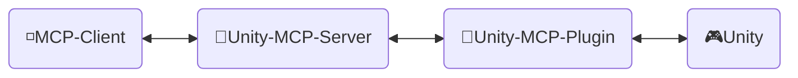
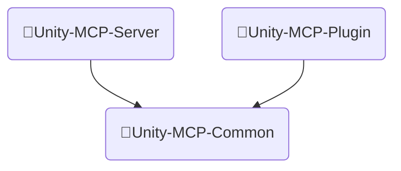
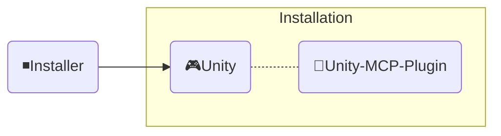

<div align="center" width="100%">
  <h1>🛠️ Development ─ AI Game Developer</h1>

[](https://modelcontextprotocol.io/introduction)
[](https://openupm.com/packages/com.ivanmurzak.unity.mcp/)
[](https://hub.docker.com/r/ivanmurzakdev/unity-mcp-server)
[](https://unity.com/releases/editor/archive)
[](https://unity.com/releases/editor/archive)
[](https://github.com/IvanMurzak/Unity-MCP/actions/workflows/release.yml)</br>
[](https://discord.gg/cfbdMZX99G)
[](https://github.com/IvanMurzak/Unity-MCP/stargazers)
[](https://github.com/IvanMurzak/Unity-MCP/blob/main/LICENSE)
[](https://stand-with-ukraine.pp.ua)

  <b>[English](https://github.com/IvanMurzak/Unity-MCP/blob/main/docs/dev/Development.md) | [Español](https://github.com/IvanMurzak/Unity-MCP/blob/main/docs/dev/Development.es.md) | [中文](https://github.com/IvanMurzak/Unity-MCP/blob/main/docs/dev/Development.zh-CN.md)</b>

</div>

**ビジョン**

私たちは、AIがゲーム開発の重要な一部になる(すでになっているかもしれません)と信じています。`Claude`、`Copilot`、`Cursor`など、素晴らしいAIインターフェースが存在します。これらは優れたエージェントと機能を提供し、最も重要なことに、継続的に改善されています。これらのプロジェクトは莫大な予算を持ち、おそらくプロフェッショナル向けの最高のAIプラットフォームになるでしょう。私たちはゲーム開発をこれらのツールと接続し、このプロジェクトはそれらと協力して機能し、対立するものではありません。私たちは彼らと共に成長していきます。そのため、このプロジェクトは独立した内部チャットウィンドウを実装しません。私たちは、Unity Engineエコシステムにおけるゲーム開発のAIシステムの基盤となる、シンプルでエレガントなソリューションを構築したいと考えています。

**プロジェクトの目標**

- すべての人に**無料**で高品質なAIゲーム開発ソリューションを提供する
- ゲーム開発者がニーズに合わせてAI機能をカスタマイズできる、高度にカスタマイズ可能なプラットフォームを提供する
- ゲーム開発に最適なAIツールを一か所で利用できるようにする
- Unity Engineを中心に、そしてエンジンを超えて、ゲーム開発のための最先端AI技術を維持・サポートする

**貢献**

プロジェクトへの貢献を心から歓迎します。私たちの目標、ビジョン、プロジェクト構造を理解するために、このドキュメントに従ってください。これらはすべて、あなたがゲーム開発の新しい技術時代に参加するのに役立つはずです。

**このドキュメントについて**

このドキュメントでは、プロジェクトの内部構造、設計、コードスタイル、および主要な原則について説明します。貢献者の方、またはプロジェクトを深く理解したい方は、このドキュメントをご利用ください。

> **[💬 Discordサーバーに参加](https://discord.gg/cfbdMZX99G)** - 質問をしたり、作品を紹介したり、他の開発者とつながったりしましょう!

## 目次

- [貢献](#貢献)
- [プロジェクト構造](#プロジェクト構造)
  - [🔹Unity-MCP-Server](#unity-mcp-server)
    - [Dockerイメージ](#dockerイメージ)
  - [🔸Unity-MCP-Plugin](#unity-mcp-plugin)
    - [UPMパッケージ](#upmパッケージ)
    - [Editor](#editor)
    - [Runtime](#runtime)
    - [MCP機能](#mcp機能)
      - [`MCP Tool`の追加](#mcp-toolの追加)
      - [`MCP Prompt`の追加](#mcp-promptの追加)
  - [🔺Unity-MCP-Common](#unity-mcp-common)
  - [◾Installer (Unity)](#installer-unity)
- [コードスタイル](#コードスタイル)
- [CI/CD](#cicd)
  - [ワークフロー概要](#ワークフロー概要)
    - [🚀 release.yml](#-releaseyml)
    - [🧪 test\_pull\_request.yml](#-test_pull_requestyml)
    - [🔧 test\_unity\_plugin.yml](#-test_unity_pluginyml)
    - [📦 deploy.yml](#-deployyml)
    - [🎯 deploy\_server\_executables.yml](#-deploy_server_executablesyml)
  - [技術スタック](#技術スタック)
  - [セキュリティに関する考慮事項](#セキュリティに関する考慮事項)
  - [デプロイ先](#デプロイ先)

# 貢献

明るいゲーム開発の未来を一緒に築きましょう。プロジェクトに貢献してください。このドキュメントを使用して、プロジェクト構造とその動作を理解してください。

1. [プロジェクトをForkする](https://github.com/IvanMurzak/Unity-MCP/fork)
2. コードスタイルに従って改善を行う
3. [Pull Requestを作成する](https://github.com/IvanMurzak/Unity-MCP/compare)

# プロジェクト構造



◽**MCP Client** - *Claude*、*Copilot*、*Cursor*などの任意のAIインターフェース。これらのプロジェクトの一部ではありませんが、アーキテクチャの重要な要素です。

🔹**Unity-MCP-Server** - `MCP Client`に接続し、それと通信する`MCP Server`。同時に、`Unity-MCP-Server`はSignalRを介して`Unity-MCP-Plugin`と通信します。ローカルまたはHTTPトランスポートを使用してクラウドで実行できます。技術スタック: `C#`、`ASP.NET Core`、`SignalR`

🔸**Unity-MCP-Plugin** - Unityプロジェクトに統合される`Unity Plugin`で、UnityのAPIにアクセスできます。`Unity-MCP-Server`と通信し、サーバーからのコマンドを実行します。技術スタック: `C#`、`Unity`、`SignalR`

🎮**Unity** - Unity Engine、ゲームエンジン。

---

## 🔹Unity-MCP-Server

MCPクライアント(Claude、Cursorなどのインターフェース)とUnity Editorインスタンス間のブリッジとして機能するC# ASP.NET Coreアプリケーション。サーバーは[csharp-sdk](https://github.com/modelcontextprotocol/csharp-sdk)を使用して[Model Context Protocol](https://github.com/modelcontextprotocol)を実装しています。

> プロジェクトの場所: `Unity-MCP-Server`

**主な責務:**

1. **MCPプロトコルの実装** ([ExtensionsMcpServer.cs](Unity-MCP-Server/src/Extension/ExtensionsMcpServer.cs))
   - Tools、Prompts、ResourcesをサポートするMCPサーバーを実装
   - STDIOとHTTPの両方のトランスポート方式をサポート
   - MCPクライアントのリクエストを処理: `CallTool`、`GetPrompt`、`ReadResource`、およびそれらのリスト操作
   - 機能が変更されたときにMCPクライアントに通知を送信(tool/promptリストの更新)

2. **SignalR Hub通信** ([RemoteApp.cs](Unity-MCP-Server/src/Hub/RemoteApp.cs), [BaseHub.cs](Unity-MCP-Server/src/Hub/BaseHub.cs))
   - SignalRを介したUnity-MCP-Pluginとのリアルタイム双方向通信を管理
   - サーバーとプラグイン間のAPI互換性を確保するためのバージョンハンドシェイクを処理
   - クライアント接続を追跡し、切断を管理
   - UnityからMCPクライアントへのtool/prompt/resource更新通知をルーティング

3. **リクエストルーティングと実行** ([ToolRouter.Call.cs](Unity-MCP-Server/src/Routing/Tool/ToolRouter.Call.cs), [PromptRouter.Get.cs](Unity-MCP-Server/src/Routing/Prompt/PromptRouter.Get.cs), [ResourceRouter.ReadResource.cs](Unity-MCP-Server/src/Routing/Resource/ResourceRouter.ReadResource.cs))
   - MCPクライアントのリクエストを適切なUnity-MCP-Pluginインスタンスにルーティング
   - Toolコール、Promptリクエスト、Resourceの読み取りを処理
   - エラーハンドリングと検証を実行
   - MCPプロトコル形式と内部データモデル間の変換を行う

4. **リモート実行サービス** ([RemoteToolRunner.cs](Unity-MCP-Server/src/Client/RemoteToolRunner.cs), [RemotePromptRunner.cs](Unity-MCP-Server/src/Client/RemotePromptRunner.cs), [RemoteResourceRunner.cs](Unity-MCP-Server/src/Client/RemoteResourceRunner.cs))
   - SignalRを介してUnity-MCP-Pluginのリモートプロシージャを呼び出す
   - 非同期リクエストを追跡し、タイムアウトを管理
   - キャンセルサポート付きのリクエスト/レスポンスパターンを実装
   - Unityインスタンスからのリクエスト完了コールバックを処理

5. **サーバーライフサイクル管理** ([Program.cs](Unity-MCP-Server/src/Program.cs), [McpServerService.cs](Unity-MCP-Server/src/McpServerService.cs))
   - KestrelでASP.NET Core Webサーバーを設定・起動
   - MCPサーバー、SignalR Hub、依存性注入を初期化
   - NLogでログ管理(STDIOモードではログをstderrにリダイレクト)
   - グレースフルシャットダウンとリソースクリーンアップを処理
   - Unity tool/promptリスト変更イベントを購読

### Dockerイメージ

`Unity-MCP-Server`はDockerイメージにデプロイ可能です。プロジェクトフォルダに`Dockerfile`と`.dockerignore`ファイルが含まれています。

---

## 🔸Unity-MCP-Plugin

Unity環境に統合されます。ローカルコードベース内のMCP *Tool*、*Resource*、*Prompt*をリフレクションを使用して検索するために`Unity-MCP-Common`を使用します。MCP *Tool*、*Resource*、*Prompt*に関する更新を送信するために`Unity-MCP-Server`と通信します。`Unity-MCP-Server`からコマンドを受け取り、実行します。

> プロジェクトの場所: `Unity-MCP-Plugin`

### UPMパッケージ

`Unity-MCP-Plugin`はUPMパッケージで、パッケージのルートフォルダはに配置されています。`package.json`が含まれており、GitHubリリースから[OpenUPM](https://openupm.com/)に直接パッケージをアップロードするために使用されます。

> 場所 `Unity-MCP-Plugin/Assets/root`

### Editor

Editorコンポーネントは、Unity Editorの統合を提供し、MCP機能(Tools、Prompts、Resources)を実装し、`Unity-MCP-Server`のライフサイクルを管理します。

> 場所 `Unity-MCP-Plugin/Assets/root/Editor`

**主な責務:**

1. **プラグインライフサイクル管理** ([Startup.cs](../../Unity-MCP-Plugin/Assets/root/Editor/Scripts/Startup.cs))
   - `[InitializeOnLoad]`を介したUnity Editor読み込み時の自動初期化
   - Editorライフサイクルイベント(アセンブリリロード、Playモード遷移)全体での接続の永続化を管理
   - ドメインリロードまたはPlayモード終了後の自動再接続

2. **MCPサーバーバイナリ管理** ([Startup.Server.cs](../../Unity-MCP-Plugin/Assets/root/Editor/Scripts/Startup.Server.cs))
   - GitHubリリースから`Unity-MCP-Server`実行可能ファイルをダウンロード・管理
   - クロスプラットフォームバイナリ選択(Windows/macOS/Linux、x86/x64/ARM/ARM64)
   - サーバーとプラグイン間のバージョン互換性の強制
   - MCPクライアント用の設定生成(実行可能ファイルパスと接続設定を含むJSON)

3. **MCP API実装** ([Scripts/API/](../../Unity-MCP-Plugin/Assets/root/Editor/Scripts/API/))
   - **Tools** (50+): GameObject、Scene、Assets、Prefabs、Scripts、Components、Editor Control、Test Runner、Console、Reflection
   - **Prompts**: 一般的なUnity開発タスク用の事前構築されたテンプレート
   - **Resources**: JSONシリアライゼーションを使用したUnity EditorデータへのURIベースのアクセス
   - すべての操作はスレッドセーフのためにUnityのメインスレッドで実行
   - `[McpPluginTool]`、`[McpPluginPrompt]`、`[McpPluginResource]`を使用した属性ベースの検出

4. **Editor UI** ([Scripts/UI/](../../Unity-MCP-Plugin/Assets/root/Editor/Scripts/UI/))
   - 接続管理用の設定ウィンドウ(`Window > AI Game Developer`)
   - Unityメニュー項目を介したサーバーバイナリ管理とログアクセス

### Runtime

Runtimeコンポーネントは、EditorモードとRuntimeモード間で共有されるコアインフラストラクチャを提供し、SignalR通信、シリアライゼーション、スレッドセーフなUnity APIアクセスを処理します。

> 場所 `Unity-MCP-Plugin/Assets/root/Runtime`

**主な責務:**

1. **プラグインコアとSignalR接続** ([UnityMcpPlugin.cs](../../Unity-MCP-Plugin/Assets/root/Runtime/UnityMcpPlugin.cs))
   - `BuildAndStart()`を介してプラグインライフサイクルを管理するスレッドセーフなシングルトン
   - リフレクションを使用してアセンブリからMCP Tools/Prompts/Resourcesを検出
   - Unity-MCP-ServerへのSignalR接続を確立し、リアクティブな状態監視を実装(R3ライブラリ)
   - 設定管理: ホスト、ポート、タイムアウト、バージョン互換性

2. **メインスレッドディスパッチャ** ([MainThreadDispatcher.cs](../../Unity-MCP-Plugin/Assets/root/Runtime/Utils/MainThreadDispatcher.cs))
   - SignalRバックグラウンドスレッドからUnityのメインスレッドへUnity APIコールをマーシャリング
   - UnityのUpdateループでのキューベースの実行
   - スレッドセーフなMCP操作実行に不可欠

3. **Unity型のシリアライゼーション** ([ReflectionConverters/](../../Unity-MCP-Plugin/Assets/root/Runtime/ReflectionConverters/), [JsonConverters/](../../Unity-MCP-Plugin/Assets/root/Runtime/JsonConverters/))
   - Unity型(GameObject、Component、Transform、Vector3、Quaternionなど)用のカスタムJSONシリアライゼーション
   - UnityオブジェクトをinstanceID追跡付きの参照形式(`GameObjectRef`、`ComponentRef`)に変換
   - オブジェクトのイントロスペクションとコンポーネントシリアライゼーションのためにReflectorNetと統合
   - MCPプロトコル型定義用のJSONスキーマを提供

4. **ロギングと診断** ([Logger/](../../Unity-MCP-Plugin/Assets/root/Runtime/Logger/), [Unity/Logs/](../../Unity-MCP-Plugin/Assets/root/Runtime/Unity/Logs/))
   - Microsoft.Extensions.LoggingをUnity Consoleに色分けされたレベルでブリッジ
   - MCP Tools経由でAIコンテキスト取得用のUnity Consoleログを収集

### MCP機能

#### `MCP Tool`の追加

```csharp
[McpPluginToolType]
public class Tool_GameObject
{
    [McpPluginTool
    (
        "MyCustomTask",
        Title = "Create a new GameObject"
    )]
    [Description("Explain here to LLM what is this, when it should be called.")]
    public string CustomTask
    (
        [Description("Explain to LLM what is this.")]
        string inputData
    )
    {
        // バックグラウンドスレッドで何でも実行可能

        return MainThread.Instance.Run(() =>
        {
            // 必要に応じてメインスレッドで何かを実行

            return $"[Success] Operation completed.";
        });
    }
}
```

#### `MCP Prompt`の追加

`MCP Prompt`を使用すると、LLMとの会話にカスタムプロンプトを注入できます。UserとAssistantの2つの送信者ロールをサポートしています。これは、LLMに特定のタスクを実行するよう指示する迅速な方法です。カスタムデータを使用してプロンプトを生成し、リストやその他の関連情報を提供できます。

```csharp
[McpPluginPromptType]
public static class Prompt_ScriptingCode
{
    [McpPluginPrompt(Name = "add-event-system", Role = Role.User)]
    [Description("Implement UnityEvent-based communication system between GameObjects.")]
    public string AddEventSystem()
    {
        return "Create event system using UnityEvents, UnityActions, or custom event delegates for decoupled communication between game systems and components.";
    }
}
```

---

## 🔺Unity-MCP-Common



**Unity-MCP-Common** - `Unity-MCP-Server`と`Unity-MCP-Plugin`間で共有されるコードベース。プロジェクト間のデータモデルとAPI共有を簡素化するために必要です。独立したdotnetライブラリプロジェクトです。

> プロジェクトの場所: `Unity-MCP-Plugin/Assets/root/Unity-MCP-Common`

---

## ◾Installer (Unity)



**Installer**は`Unity-MCP-Plugin`と依存関係をNPMパッケージとしてUnityプロジェクトにインストールします。

> プロジェクトの場所: `Installer`

---

# コードスタイル

このプロジェクトは一貫したC#コーディングパターンに従っています。以下は、主要な規約を示す包括的な例です:

```csharp
/*
┌──────────────────────────────────────────────────────────────────┐
│  Author: Ivan Murzak (https://github.com/IvanMurzak)             │
│  Repository: GitHub (https://github.com/IvanMurzak/Unity-MCP)    │
│  Copyright (c) 2025 Ivan Murzak                                  │
│  Licensed under the Apache License, Version 2.0.                 │
│  See the LICENSE file in the project root for more information.  │
└──────────────────────────────────────────────────────────────────┘
*/

// より良いnull安全性のためにnullable参照型を有効化
#nullable enable

// プラットフォーム固有のコード用の条件付きコンパイル
#if UNITY_EDITOR
using UnityEditor;
#endif

using System;
using System.ComponentModel;
using System.Threading.Tasks;
using com.IvanMurzak.Unity.MCP.Common;
using com.IvanMurzak.Unity.MCP.Utils;
using UnityEngine;

namespace com.IvanMurzak.Unity.MCP.Editor.API
{
    // ツールクラスには[McpPluginToolType]を使用 - リフレクションを介したMCP検出を有効化
    [McpPluginToolType]
    // partialクラスは複数のファイルに実装を分割可能
    // パターン: 1操作につき1ファイル(例: GameObject.Create.cs、GameObject.Destroy.cs)
    public partial class Tool_GameObject
    {
        // ネストされたErrorクラスはメンテナンス性のためにエラーメッセージを一元化
        public static class Error
        {
            // 一貫したエラーフォーマットのための静的メソッド
            public static string GameObjectNameIsEmpty()
                => "[Error] GameObject name is empty. Please provide a valid name.";

            public static string NotFoundGameObjectAtPath(string path)
                => $"[Error] GameObject '{path}' not found.";
        }

        // 属性ベースのメタデータを持つMCP Tool宣言
        [McpPluginTool(
            "GameObject_Create",                    // 一意のツール識別子
            Title = "Create a new GameObject"       // 人間が読める形式のタイトル
        )]
        // Description属性はAIにこのツールをいつ/どのように使用するかをガイド
        [Description(@"Create a new GameObject in the scene.
Provide position, rotation, and scale to minimize subsequent operations.")]
        public string Create
        (
            // パラメータの説明はAIが期待される入力を理解するのに役立つ
            [Description("Name of the new GameObject.")]
            string name,

            [Description("Parent GameObject reference. If not provided, created at scene root.")]
            GameObjectRef? parentGameObjectRef = null,  // デフォルト値付きのNullable

            [Description("Transform position of the GameObject.")]
            Vector3? position = null,                    // Unity構造体、nullable

            [Description("Transform rotation in Euler angles (degrees).")]
            Vector3? rotation = null,

            [Description("Transform scale of the GameObject.")]
            Vector3? scale = null
        )
        // 即座のメインスレッド実行のためのラムダ式構文
        => MainThread.Instance.Run(() =>           // すべてのUnity APIコールはメインスレッドで実行する必要がある
        {
            // 入力パラメータを早期に検証
            if (string.IsNullOrEmpty(name))
                return Error.GameObjectNameIsEmpty();

            // デフォルト値のためのNull合体代入
            position ??= Vector3.zero;
            rotation ??= Vector3.zero;
            scale ??= Vector3.one;

            // Unity APIを使用してGameObjectを作成
            var go = new GameObject(name);

            // 提供されている場合は親を設定
            if (parentGameObjectRef?.IsValid ?? false)
            {
                var parentGo = parentGameObjectRef.FindGameObject(out var error);
                if (error != null)
                    return $"[Error] {error}";

                go.transform.SetParent(parentGo.transform, worldPositionStays: false);
            }

            // トランスフォーム値を適用
            go.transform.localPosition = position.Value;
            go.transform.localRotation = Quaternion.Euler(rotation.Value);
            go.transform.localScale = scale.Value;

            // Unity Editorのために変更済みとしてマーク
            EditorUtility.SetDirty(go);

            // 構造化データを含む成功メッセージを返す
            // 読みやすいフォーマットのために文字列補間を使用
            return $"[Success] Created GameObject.\ninstanceID: {go.GetInstanceID()}, path: {go.GetPath()}";
        });

        // 適切なエラーハンドリングを伴う非同期メソッドの例
        public static async Task<string> AsyncOperation(string parameter)
        {
            try
            {
                // バックグラウンド作業はここで実行可能
                await Task.Delay(100);

                // Unity APIコールのためにメインスレッドに切り替え
                return await MainThread.Instance.RunAsync(() =>
                {
                    // Unity APIコールはここで実行
                    return "[Success] Async operation completed.";
                });
            }
            catch (Exception ex)
            {
                // 構造化ログで例外をログ記録
                Debug.LogException(ex);
                return $"[Error] Operation failed: {ex.Message}";
            }
        }
    }

    // プロンプト用の別のpartialクラスファイル
    [McpPluginPromptType]
    public static partial class Prompt_SceneManagement
    {
        // ロール定義(UserまたはAssistant)を持つMCP Prompt
        [McpPluginPrompt(Name = "setup-basic-scene", Role = Role.User)]
        [Description("Setup a basic scene with camera, lighting, and environment.")]
        public static string SetupBasicScene()
        {
            // AIが処理するためのプロンプトテキストを返す
            return "Create a basic Unity scene with Main Camera, Directional Light, and basic environment setup.";
        }
    }
}
```

**主要な規約:**

1. **ファイルヘッダー**: ボックスコメント形式で著作権表示を含める
2. **Nullableコンテキスト**: null安全性のために`#nullable enable`を使用
3. **属性**: MCP検出のために`[McpPluginTool]`、`[McpPluginPrompt]`、`[McpPluginResource]`を活用
4. **Partialクラス**: 機能をファイル間で分割(例: `Tool_GameObject.Create.cs`)
5. **メインスレッド実行**: Unity APIコールを`MainThread.Instance.Run()`でラップ
6. **エラーハンドリング**: ネストされた`Error`クラスでエラーメッセージを一元化
7. **返り値の形式**: 返り値の文字列に`[Success]`または`[Error]`プレフィックスを使用
8. **説明**: AIガイダンスのためにすべてのパブリックAPIに`[Description]`で注釈を付ける
9. **命名規則**: パブリックメンバーにはPascalCase、プライベート/ローカルにはcamelCaseを使用
10. **Null安全性**: nullable型(`?`)とnull合体演算子(`??`、`??=`)を使用

---

# CI/CD

プロジェクトは、複数のワークフローがビルド、テスト、デプロイプロセスを調整するGitHub Actionsを使用した包括的なCI/CDパイプラインを実装しています。

## ワークフロー概要

> 場所: `.github/workflows`

### 🚀 [release.yml](../../.github/workflows/release.yml)

**トリガー:** `main`ブランチへのプッシュ
**目的:** リリースプロセス全体を調整するメインリリースワークフロー

**プロセス:**

1. **バージョンチェック** - [package.json](../../Unity-MCP-Plugin/Assets/root/package.json)からバージョンを抽出し、リリースタグがすでに存在するかチェック
2. **Unity Installerのビルド** - Unityパッケージインストーラー(`AI-Game-Dev-Installer.unitypackage`)をテストしてエクスポート
3. **MCP Serverのビルド** - [build-all.sh](../../Unity-MCP-Server/build-all.sh)を使用してクロスプラットフォーム実行可能ファイル(Windows、macOS、Linux)をコンパイル
4. **Unity Pluginのテスト** - 以下の包括的なテストを実行:
   - 3つのUnityバージョン: `2022.3.69f1`, `2023.2.22f1`, `6000.3.1f1`
   - 3つのテストモード: `editmode`, `playmode`, `standalone`
   - 2つのオペレーティングシステム: `windows-latest`, `ubuntu-latest`
   - 合計: **18のテストマトリックスの組み合わせ**
5. **リリース作成** - コミットからリリースノートを生成し、タグ付きのGitHubリリースを作成
6. **公開** - UnityインストーラーパッケージとMCP Server実行可能ファイルをリリースにアップロード
7. **Discord通知** - フォーマットされたリリースノートをDiscordチャンネルに送信
8. **デプロイ** - NuGetとDocker用のデプロイワークフローをトリガー
9. **クリーンアップ** - 公開成功後にビルドアーティファクトを削除

### 🧪 [test_pull_request.yml](../../.github/workflows/test_pull_request.yml)

**トリガー:** `main`または`dev`ブランチへのPull Request
**目的:** マージ前にPRの変更を検証

**プロセス:**

1. すべてのプラットフォーム用のMCP Server実行可能ファイルをビルド
2. リリースワークフローと同じ18のUnityテストマトリックスの組み合わせを実行
3. PRをマージする前にすべてのテストが成功する必要がある

### 🔧 [test_unity_plugin.yml](../../.github/workflows/test_unity_plugin.yml)

**タイプ:** 再利用可能なワークフロー
**目的:** リリースワークフローとPRワークフローの両方で使用されるパラメータ化されたUnityテストワークフロー

**機能:**

- パラメータを受け入れる: `projectPath`, `unityVersion`, `testMode`
- オペレーティングシステムのマトリックスで実行(Windows、Ubuntu)
- カスタムDockerイメージを使用したGame CI Unity Test Runnerを使用
- PR貢献者のセキュリティチェックを実装(信頼されていないPRには`ci-ok`ラベルが必要)
- PRでワークフローファイルが変更された場合は中止
- 後続の実行を高速化するためにUnity Libraryをキャッシュ
- デバッグ用のテストアーティファクトをアップロード

### 📦 [deploy.yml](../../.github/workflows/deploy.yml)

**トリガー:** リリースワークフローによる呼び出しまたは手動ディスパッチまたはリリース公開時
**目的:** MCP ServerをNuGetとDocker Hubにデプロイ

**ジョブ:**

**1. NuGetへのデプロイ:**

- MCP Serverをビルドしてテスト
- NuGetパッケージをパック
- [nuget.org](https://www.nuget.org/packages/com.IvanMurzak.Unity.MCP.Server)に公開

**2. Dockerイメージのデプロイ:**

- マルチプラットフォームDockerイメージをビルド(linux/amd64、linux/arm64)
- [Docker Hub](https://hub.docker.com/r/ivanmurzakdev/unity-mcp-server)にプッシュ
- バージョン番号と`latest`でタグ付け
- ビルド最適化のためにGitHub Actionsキャッシュを使用

### 🎯 [deploy_server_executables.yml](../../.github/workflows/deploy_server_executables.yml)

**トリガー:** GitHubリリース公開時
**目的:** クロスプラットフォームサーバー実行可能ファイルをビルドし、リリースにアップロード

**プロセス:**

- クロスコンパイルサポートのためにmacOSで実行
- [build-all.sh](../../Unity-MCP-Server/build-all.sh)を使用してWindows、macOS、Linux用の実行可能ファイルをビルド
- 各プラットフォーム用のZIPアーカイブを作成
- GitHubリリースにアップロード

## 技術スタック

- **CIプラットフォーム:** GitHub Actions
- **Unityテスト:** Unity Test Runner付きの[Game CI](https://game.ci/)
- **コンテナ化:** マルチプラットフォームビルド付きのDocker
- **パッケージ管理:** NuGet、OpenUPM、Docker Hub
- **ビルドツール:** .NET 9.0、bashスクリプト
- **アーティファクトストレージ:** GitHub Actionsアーティファクト(一時)、GitHub Releases(永続)

## セキュリティに関する考慮事項

- Unityライセンス、メール、パスワードはGitHubシークレットとして保存
- NuGet APIキーとDocker認証情報は保護
- PRワークフローにはワークフローファイル変更の安全性チェックを含む
- 信頼されていないPR貢献は`ci-ok`ラベルによるメンテナーの承認が必要

## デプロイ先

1. **GitHub Releases** - UnityインストーラーパッケージとMCP Server実行可能ファイル
2. **NuGet** - .NET開発者向けのMCP Serverパッケージ
3. **Docker Hub** - クラウドデプロイ用のコンテナ化されたMCP Server
4. **OpenUPM** - Unityプラグインパッケージ(GitHubリリースから自動同期)
