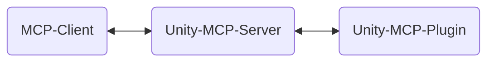
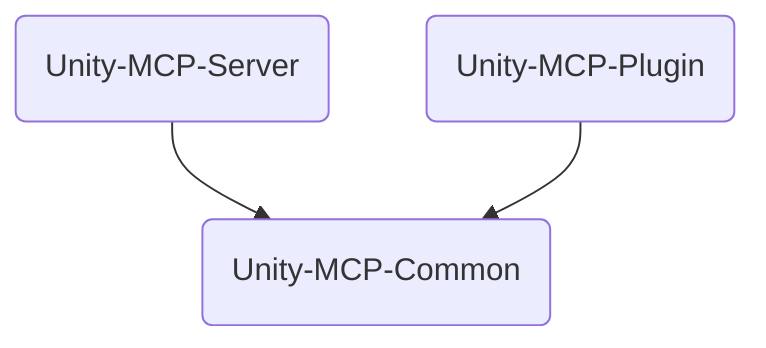

<div align="center" width="100%">
  <h1>🛠️ Contribute to AI Game Developer</h1>

[](https://modelcontextprotocol.io/introduction)
[](https://openupm.com/packages/com.ivanmurzak.unity.mcp/)
[](https://hub.docker.com/r/ivanmurzakdev/unity-mcp-server)
[](https://unity.com/releases/editor/archive)
[](https://unity.com/releases/editor/archive)
[](https://github.com/IvanMurzak/Unity-MCP/actions/workflows/release.yml)</br>
[](https://discord.gg/cfbdMZX99G)
[](https://github.com/IvanMurzak/Unity-MCP/stargazers)
[](https://github.com/IvanMurzak/Unity-MCP/blob/main/LICENSE)
[](https://stand-with-ukraine.pp.ua)

</div>

**Contribute**
Any contribution to the project is highly appreciated. Please follow this document to see out goals, vision and project structure. All of that should help to let you participate in the new technological era of game development

**Project goals**

- To deliver high quality AI game development solution for free to everyone
- To maintain and support cutting edge AI technologies in Unity Engine and beyond the engine itself
- To provide a highly customizable platform for other developer to let them customize AI features for their needs
- To

**Vision**
We believe that AI will be an important part of the game development. There are many companies trying to charge for using AI. They


**This document**
This document is explaining the internal project structure and design, code style, and main principals. Please use it if you are a contributor or if you like to understand the project in depth.

> **[💬 Join our Discord Server](https://discord.gg/cfbdMZX99G)** - Ask questions, showcase your work, and connect with other developers!

## Content

- [Project structure](#project-structure)
  - [Add custom `MCP Prompt`](#add-custom-mcp-prompt)
- [Runtime usage (in-game)](#runtime-usage-in-game)
  - [Sample: AI powered Chess game bot](#sample-ai-powered-chess-game-bot)

# Project structure

`AI Game Developer` contains multiple different project and work as collaboration of multiple system working together. Here is the main structure of the project:



`Unity-MCP-Server` and `Unity-MCP-Plugin` are written with C# and they both use SignalR to communicate.



- `Unity-MCP-Server`
- `Unity-MCP-Plugin`
- `Unity-MCP-Common`
- `Installer`


```csharp
[McpPluginToolType]
public class Tool_GameObject
{
    [McpPluginTool
    (
        "MyCustomTask",
        Title = "Create a new GameObject"
    )]
    [Description("Explain here to LLM what is this, when it should be called.")]
    public string CustomTask
    (
        [Description("Explain to LLM what is this.")]
        string inputData
    )
    {
        // do anything in background thread

        return MainThread.Instance.Run(() =>
        {
            // do something in main thread if needed

            return $"[Success] Operation completed.";
        });
    }
}
```

## Add custom `MCP Prompt`

`MCP Prompt` allows you to inject custom prompts into the conversation with the LLM. It supports two sender roles: User and Assistant. This is a quick way to instruct the LLM to perform specific tasks. You can generate prompts using custom data, providing lists or any other relevant information.

```csharp
[McpPluginPromptType]
public static class Prompt_ScriptingCode
{
    [McpPluginPrompt(Name = "add-event-system", Role = Role.User)]
    [Description("Implement UnityEvent-based communication system between GameObjects.")]
    public string AddEventSystem()
    {
        return "Create event system using UnityEvents, UnityActions, or custom event delegates for decoupled communication between game systems and components.";
    }
}
```

---

# Runtime usage (in-game)

Use **[Unity MCP](https://github.com/IvanMurzak/Unity-MCP)** in your game/app. Use Tools, Resources or Prompts. By default there are no tools, you would need to implement your custom.

```csharp
UnityMcpPlugin.BuildAndStart(); // Build and start Unity-MCP-Plugin, it is required
UnityMcpPlugin.Connect(); // Start active connection with retry to Unity-MCP-Server
UnityMcpPlugin.Disconnect(); // Stop active connection and close existed connection
```

## Sample: AI powered Chess game bot

There is a classic Chess game. Lets outsource to LLM the bot logic. Bot should do the turn using game rules.

```csharp
[McpPluginToolType]
public static class ChessGameAI
{
    [McpPluginTool("chess-do-turn", Title = "Do the turn")]
    [Description("Do the turn in the chess game. Returns true if the turn was accepted, false otherwise.")]
    public static Task<bool> DoTurn(int figureId, Vector2Int position)
    {
        return MainThread.Instance.RunAsync(() => ChessGameController.Instance.DoTurn(figureId, position));
    }

    [McpPluginTool("chess-get-board", Title = "Get the board")]
    [Description("Get the current state of the chess board.")]
    public static Task<BoardData> GetBoard()
    {
        return MainThread.Instance.RunAsync(() => ChessGameController.Instance.GetBoardData());
    }
}
```

