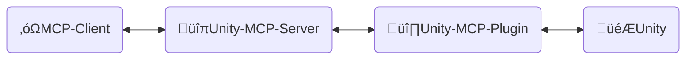
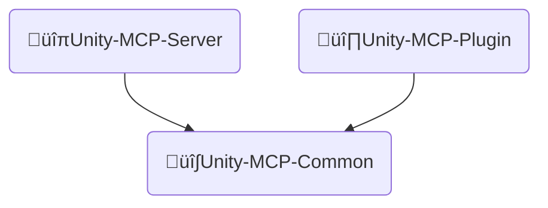
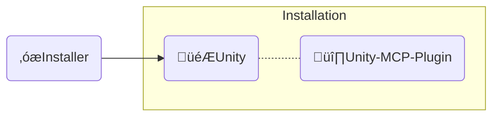

<div align="center" width="100%">
  <h1>🛠️ Contribute to AI Game Developer</h1>

[](https://modelcontextprotocol.io/introduction)
[](https://openupm.com/packages/com.ivanmurzak.unity.mcp/)
[](https://hub.docker.com/r/ivanmurzakdev/unity-mcp-server)
[](https://unity.com/releases/editor/archive)
[](https://unity.com/releases/editor/archive)
[](https://github.com/IvanMurzak/Unity-MCP/actions/workflows/release.yml)</br>
[](https://discord.gg/cfbdMZX99G)
[](https://github.com/IvanMurzak/Unity-MCP/stargazers)
[](https://github.com/IvanMurzak/Unity-MCP/blob/main/LICENSE)
[](https://stand-with-ukraine.pp.ua)

</div>

**Vision**

We believe that AI will be (if not already) an important part of the game development. There are amazing AI interfaces such as `Claude`, `Copilot`, `Cursor` and many others. They provide amazing agents and features and the most important - they keep improving it. These projects have huge budgets and probably will be the best AI platforms for professionals. We connect game development with these tools, this project works in a pair with them, not against them. We will grow with them. That is why this project won't implement internal isolated chat window. We want to build simple and elegant solution which became a foundation for AI systems in game development with Unity Engine ecosystem.

**Project goals**

- Deliver high quality AI game development solution for **free** to everyone
- Provide a highly customizable platform for game developers for customizing AI features for their needs
- Allow to utilize the best AI instruments for game development, all in one place
- Maintain and support cutting edge AI technologies for game development especially in Unity Engine and beyond the engine

**Contribute**

Any contribution to the project is highly appreciated. Please follow this document to see out goals, vision and project structure. All of that should help to let you participate in the new technological era of game development

**This document**

This document explains the internal project structure, design, code style, and main principals. Please use it if you are a contributor or if you like to understand the project in depth.

> **[💬 Join our Discord Server](https://discord.gg/cfbdMZX99G)** - Ask questions, showcase your work, and connect with other developers!

## Content

- [Contribute](#contribute)
- [Projects structure](#projects-structure)
  - [🔹Unity-MCP-Server](#unity-mcp-server)
    - [Docker Image](#docker-image)
  - [🔸Unity-MCP-Plugin](#unity-mcp-plugin)
    - [UPM Package](#upm-package)
    - [Editor](#editor)
    - [Runtime](#runtime)
    - [MCP features](#mcp-features)
      - [Add `MCP Tool`](#add-mcp-tool)
      - [Add `MCP Prompt`](#add-mcp-prompt)
  - [🔺Unity-MCP-Common](#unity-mcp-common)
  - [◾Installer (Unity)](#installer-unity)
- [Code style](#code-style)
- [CI/CD](#cicd)
  - [Workflows Overview](#workflows-overview)
    - [🚀 release.yml](#-releaseyml)
    - [🧪 test\_pull\_request.yml](#-test_pull_requestyml)
    - [🔧 test\_unity\_plugin.yml](#-test_unity_pluginyml)
    - [📦 deploy.yml](#-deployyml)
    - [🎯 deploy\_server\_executables.yml](#-deploy_server_executablesyml)
  - [Technology Stack](#technology-stack)
  - [Security Considerations](#security-considerations)
  - [Deployment Targets](#deployment-targets)

# Contribute

Lets build the bright game development future together, contribute to the project. Use this document to understand the project structure and how exactly it works.

1. [Fork the project](https://github.com/IvanMurzak/Unity-MCP/fork)
2. Make your improvements, follow code style
3. [Create Pull Request](https://github.com/IvanMurzak/Unity-MCP/compare)

# Projects structure



◽**MCP Client** - Any AI interface such as: *Claude*, *Copilot*, *Cursor* or any other, it is not part of these project, but it is an important element of the architecture.

🔹**Unity-MCP-Server** - `MCP Server` that connects to `MCP Client` and operates with it. In the same `Unity-MCP-Server` communicates with `Unity-MCP-Plugin` over SignalR. May run locally or in a cloud with HTTP transport. Tech stack: `C#`, `ASP.NET Core`, `SignalR`

🔸**Unity-MCP-Plugin** - `Unity Plugin` which is integrated into a Unity project, has access to Unity's API. Communicates with `Unity-MCP-Server` and executes commands from the server. Tech stack: `C#`, `Unity`, `SignalR`

🎮**Unity** - Unity Engine, game engine.

---

## 🔹Unity-MCP-Server

A C# ASP.NET Core application that acts as a bridge between MCP clients (AI interfaces like Claude, Cursor) and Unity Editor instances. The server implements the [Model Context Protocol](https://github.com/modelcontextprotocol) using the [csharp-sdk](https://github.com/modelcontextprotocol/csharp-sdk).

> Project location: `Unity-MCP-Server`

**Main Responsibilities:**

1. **MCP Protocol Implementation** ([ExtensionsMcpServer.cs](Unity-MCP-Server/src/Extension/ExtensionsMcpServer.cs))
   - Implements MCP server with support for Tools, Prompts, and Resources
   - Supports both STDIO and HTTP transport methods
   - Handles MCP client requests: `CallTool`, `GetPrompt`, `ReadResource`, and their list operations
   - Sends notifications to MCP clients when capabilities change (tool/prompt list updates)

2. **SignalR Hub Communication** ([RemoteApp.cs](Unity-MCP-Server/src/Hub/RemoteApp.cs), [BaseHub.cs](Unity-MCP-Server/src/Hub/BaseHub.cs))
   - Manages real-time bidirectional communication with Unity-MCP-Plugin via SignalR
   - Handles version handshake to ensure API compatibility between server and plugin
   - Tracks client connections and manages disconnections
   - Routes tool/prompt/resource update notifications from Unity to MCP clients

3. **Request Routing & Execution** ([ToolRouter.Call.cs](Unity-MCP-Server/src/Routing/Tool/ToolRouter.Call.cs), [PromptRouter.Get.cs](Unity-MCP-Server/src/Routing/Prompt/PromptRouter.Get.cs), [ResourceRouter.ReadResource.cs](Unity-MCP-Server/src/Routing/Resource/ResourceRouter.ReadResource.cs))
   - Routes MCP client requests to the appropriate Unity-MCP-Plugin instance
   - Handles Tool calls, Prompt requests, and Resource reads
   - Performs error handling and validation
   - Converts between MCP protocol formats and internal data models

4. **Remote Execution Service** ([RemoteToolRunner.cs](Unity-MCP-Server/src/Client/RemoteToolRunner.cs), [RemotePromptRunner.cs](Unity-MCP-Server/src/Client/RemotePromptRunner.cs), [RemoteResourceRunner.cs](Unity-MCP-Server/src/Client/RemoteResourceRunner.cs))
   - Invokes remote procedures on Unity-MCP-Plugin through SignalR
   - Tracks asynchronous requests and manages timeouts
   - Implements request/response patterns with cancellation support
   - Handles request completion callbacks from Unity instances

5. **Server Lifecycle Management** ([Program.cs](Unity-MCP-Server/src/Program.cs), [McpServerService.cs](Unity-MCP-Server/src/McpServerService.cs))
   - Configures and starts ASP.NET Core web server with Kestrel
   - Initializes MCP server, SignalR hub, and dependency injection
   - Manages logging with NLog (redirects logs to stderr in STDIO mode)
   - Handles graceful shutdown and resource cleanup
   - Subscribes to Unity tool/prompt list change events

### Docker Image

`Unity-MCP-Server` is deployable into a docker image. It contains `Dockerfile` and `.dockerignore` files in the folder of the project.

---

## 🔸Unity-MCP-Plugin

Integrates into Unity environment. Uses `Unity-MCP-Common` for searching for MCP *Tool*, *Resource* and *Prompt* in the local codebase using reflection. Communicates with `Unity-MCP-Server` for sending updates about MCP *Tool*, *Resource* and *Prompt*. Takes commands from `Unity-MCP-Server` and executes it.

> Project location: `Unity-MCP-Plugin`

### UPM Package

`Unity-MCP-Plugin` is a UPM package, the root folder of the package is located at . It contains `package.json`. Which is used for uploading the package directly from GitHub release to [OpenUPM](https://openupm.com/).

> Location `Unity-MCP-Plugin/Assets/root`

### Editor

> Location `Unity-MCP-Plugin/Assets/root/Editor`

### Runtime

> Location `Unity-MCP-Plugin/Assets/root/Runtime`

### MCP features

#### Add `MCP Tool`

```csharp
[McpPluginToolType]
public class Tool_GameObject
{
    [McpPluginTool
    (
        "MyCustomTask",
        Title = "Create a new GameObject"
    )]
    [Description("Explain here to LLM what is this, when it should be called.")]
    public string CustomTask
    (
        [Description("Explain to LLM what is this.")]
        string inputData
    )
    {
        // do anything in background thread

        return MainThread.Instance.Run(() =>
        {
            // do something in main thread if needed

            return $"[Success] Operation completed.";
        });
    }
}
```

#### Add `MCP Prompt`

`MCP Prompt` allows you to inject custom prompts into the conversation with the LLM. It supports two sender roles: User and Assistant. This is a quick way to instruct the LLM to perform specific tasks. You can generate prompts using custom data, providing lists or any other relevant information.

```csharp
[McpPluginPromptType]
public static class Prompt_ScriptingCode
{
    [McpPluginPrompt(Name = "add-event-system", Role = Role.User)]
    [Description("Implement UnityEvent-based communication system between GameObjects.")]
    public string AddEventSystem()
    {
        return "Create event system using UnityEvents, UnityActions, or custom event delegates for decoupled communication between game systems and components.";
    }
}
```

---

## 🔺Unity-MCP-Common



**Unity-MCP-Common** - shared code base between `Unity-MCP-Server` and `Unity-MCP-Plugin`. It is needed to simplify the data model and API sharing between projects. It is an independent dotnet library project.

> Project location: `Unity-MCP-Plugin/Assets/root/Unity-MCP-Common`

---

## ◾Installer (Unity)



**Installer** installs `Unity-MCP-Plugin` and dependencies as an NPM packages into a Unity project.

> Project location: `Installer`

---

# Code style

---

# CI/CD

The project implements a comprehensive CI/CD pipeline using GitHub Actions with multiple workflows orchestrating the build, test, and deployment processes.

## Workflows Overview

> Location: `.github/workflows`

### 🚀 [release.yml](.github/workflows/release.yml)

**Trigger:** Push to `main` branch
**Purpose:** Main release workflow that orchestrates the entire release process

**Process:**

1. **Version Check** - Extracts version from [package.json](Unity-MCP-Plugin/Assets/root/package.json) and checks if release tag already exists
2. **Build Unity Installer** - Tests and exports Unity package installer (`AI-Game-Dev-Installer.unitypackage`)
3. **Build MCP Server** - Compiles cross-platform executables (Windows, macOS, Linux) using [build-all.sh](Unity-MCP-Server/build-all.sh)
4. **Unity Plugin Testing** - Runs comprehensive tests across:
   - 3 Unity versions: `2022.3.61f1`, `2023.2.20f1`, `6000.2.3f1`
   - 3 test modes: `editmode`, `playmode`, `standalone`
   - 2 operating systems: `windows-latest`, `ubuntu-latest`
   - Total: **18 test matrix combinations**
5. **Release Creation** - Generates release notes from commits and creates GitHub release with tag
6. **Publishing** - Uploads Unity installer package and MCP Server executables to the release
7. **Discord Notification** - Sends formatted release notes to Discord channel
8. **Deploy** - Triggers deployment workflow for NuGet and Docker
9. **Cleanup** - Removes build artifacts after successful publishing

### 🧪 [test_pull_request.yml](.github/workflows/test_pull_request.yml)

**Trigger:** Pull requests to `main` or `dev` branches
**Purpose:** Validates PR changes before merging

**Process:**

1. Builds MCP Server executables for all platforms
2. Runs the same 18 Unity test matrix combinations as the release workflow
3. All tests must pass before PR can be merged

### 🔧 [test_unity_plugin.yml](.github/workflows/test_unity_plugin.yml)

**Type:** Reusable workflow
**Purpose:** Parameterized Unity testing workflow used by both release and PR workflows

**Features:**

- Accepts parameters: `projectPath`, `unityVersion`, `testMode`
- Runs on matrix of operating systems (Windows, Ubuntu)
- Uses Game CI Unity Test Runner with custom Docker images
- Implements security checks for PR contributors (requires `ci-ok` label for untrusted PRs)
- Aborts if workflow files are modified in PRs
- Caches Unity Library for faster subsequent runs
- Uploads test artifacts for debugging

### 📦 [deploy.yml](.github/workflows/deploy.yml)

**Trigger:** Called by release workflow OR manual dispatch OR on release published
**Purpose:** Deploys MCP Server to NuGet and Docker Hub

**Jobs:**

**1. Deploy to NuGet:**

- Builds and tests the MCP Server
- Packs NuGet package
- Publishes to [nuget.org](https://www.nuget.org/packages/com.IvanMurzak.Unity.MCP.Server)

**2. Deploy Docker Image:**

- Builds multi-platform Docker image (linux/amd64, linux/arm64)
- Pushes to [Docker Hub](https://hub.docker.com/r/ivanmurzakdev/unity-mcp-server)
- Tags with version number and `latest`
- Uses GitHub Actions cache for build optimization

### 🎯 [deploy_server_executables.yml](.github/workflows/deploy_server_executables.yml)

**Trigger:** GitHub release published
**Purpose:** Builds and uploads cross-platform server executables to release

**Process:**

- Runs on macOS for cross-compilation support
- Builds executables for Windows, macOS, Linux using [build-all.sh](Unity-MCP-Server/build-all.sh)
- Creates ZIP archives for each platform
- Uploads to the GitHub release

## Technology Stack

- **CI Platform:** GitHub Actions
- **Unity Testing:** [Game CI](https://game.ci/) with Unity Test Runner
- **Containerization:** Docker with multi-platform builds
- **Package Management:** NuGet, OpenUPM, Docker Hub
- **Build Tools:** .NET 9.0, bash scripts
- **Artifact Storage:** GitHub Actions artifacts (temporary), GitHub Releases (permanent)

## Security Considerations

- Unity license, email, and password stored as GitHub secrets
- NuGet API key and Docker credentials secured
- PR workflow includes safety checks for workflow file modifications
- Untrusted PR contributions require maintainer approval via `ci-ok` label

## Deployment Targets

1. **GitHub Releases** - Unity installer package and MCP Server executables
2. **NuGet** - MCP Server package for .NET developers
3. **Docker Hub** - Containerized MCP Server for cloud deployments
4. **OpenUPM** - Unity plugin package (automatically synced from GitHub releases)

