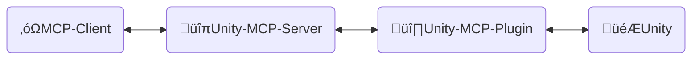
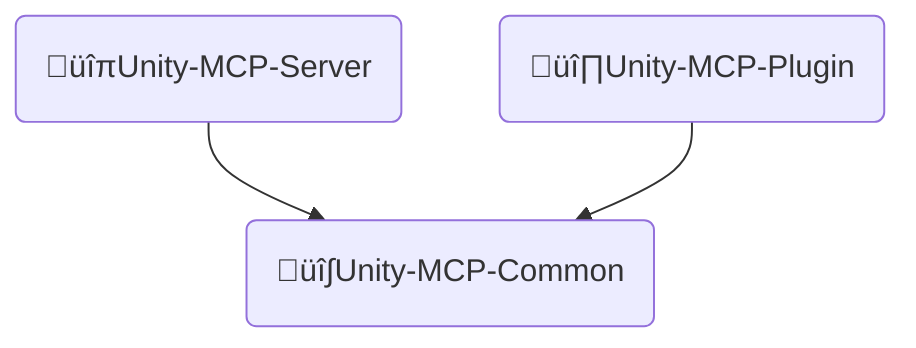
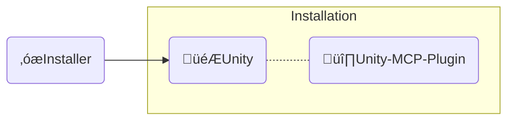

<div align="center" width="100%">
  <h1>🛠️ Contribute to AI Game Developer</h1>

[](https://modelcontextprotocol.io/introduction)
[](https://openupm.com/packages/com.ivanmurzak.unity.mcp/)
[](https://hub.docker.com/r/ivanmurzakdev/unity-mcp-server)
[](https://unity.com/releases/editor/archive)
[](https://unity.com/releases/editor/archive)
[](https://github.com/IvanMurzak/Unity-MCP/actions/workflows/release.yml)</br>
[](https://discord.gg/cfbdMZX99G)
[](https://github.com/IvanMurzak/Unity-MCP/stargazers)
[](https://github.com/IvanMurzak/Unity-MCP/blob/main/LICENSE)
[](https://stand-with-ukraine.pp.ua)

</div>

**Vision**

We believe that AI will be (if not already) an important part of the game development. There are amazing AI interfaces such as `Claude`, `Copilot`, `Cursor` and many others. They provide amazing agents and features and the most important - they keep improving it. These projects have huge budgets and probably will be the best AI platforms for professionals. We connect game development with these tools, this project works in a pair with them, not against them. We will grow with them. That is why this project won't implement internal isolated chat window. We want to build simple and elegant solution which became a foundation for AI systems in game development with Unity Engine ecosystem.

**Project goals**

- Deliver high quality AI game development solution for **free** to everyone
- Provide a highly customizable platform for game developers for customizing AI features for their needs
- Allow to utilize the best AI instruments for game development, all in one place
- Maintain and support cutting edge AI technologies for game development especially in Unity Engine and beyond the engine

**Contribute**

Any contribution to the project is highly appreciated. Please follow this document to see out goals, vision and project structure. All of that should help to let you participate in the new technological era of game development

**This document**

This document explains the internal project structure, design, code style, and main principals. Please use it if you are a contributor or if you like to understand the project in depth.

> **[💬 Join our Discord Server](https://discord.gg/cfbdMZX99G)** - Ask questions, showcase your work, and connect with other developers!

## Content

- [Project structure](#project-structure)
  - [🔹Unity-MCP-Server](#unity-mcp-server)
  - [🔸Unity-MCP-Plugin](#unity-mcp-plugin)
    - [Add `MCP Tool`](#add-mcp-tool)
    - [Add `MCP Prompt`](#add-mcp-prompt)
  - [🔺Unity-MCP-Common](#unity-mcp-common)
  - [◾Installer (Unity)](#installer-unity)

# Project structure



◽**MCP Client** - Any AI interface such as: *Claude*, *Copilot*, *Cursor* or any other, it is not part of these project, but it is an important element of the architecture.

🔹**Unity-MCP-Server** - `MCP Server` that connects to `MCP Client` and operates with it. In the same `Unity-MCP-Server` communicates with `Unity-MCP-Plugin` over SignalR. May run locally or in a cloud with HTTP transport. Tech stack: `C#`, `ASP.NET Core`, `SignalR`

🔸**Unity-MCP-Plugin** - `Unity Plugin` which is integrated into a Unity project, has access to Unity's API. Communicates with `Unity-MCP-Server` and executes commands from the server. Tech stack: `C#`, `Unity`, `SignalR`

🎮**Unity** - Unity Engine, game engine.

---

## 🔹Unity-MCP-Server

Implements [csharp-sdk](https://github.com/modelcontextprotocol/csharp-sdk) for [model context protocol](https://github.com/modelcontextprotocol). Communicates with `Unity-MCP-Plugin` over SignalR. Notifies `MCP Client` about *Tools*, *Resources*, *Prompts* updates

> Project location: `Unity-MCP-Server`

---

## 🔸Unity-MCP-Plugin

Integrates into Unity environment. Uses `Unity-MCP-Common` for searching for MCP *Tool*, *Resource* and *Prompt* in the local codebase using reflection. Communicates with `Unity-MCP-Server` for sending updates about MCP *Tool*, *Resource* and *Prompt*. Takes commands from `Unity-MCP-Server` and executes it.

> Project location: `Unity-MCP-Plugin`

### Add `MCP Tool`

```csharp
[McpPluginToolType]
public class Tool_GameObject
{
    [McpPluginTool
    (
        "MyCustomTask",
        Title = "Create a new GameObject"
    )]
    [Description("Explain here to LLM what is this, when it should be called.")]
    public string CustomTask
    (
        [Description("Explain to LLM what is this.")]
        string inputData
    )
    {
        // do anything in background thread

        return MainThread.Instance.Run(() =>
        {
            // do something in main thread if needed

            return $"[Success] Operation completed.";
        });
    }
}
```

### Add `MCP Prompt`

`MCP Prompt` allows you to inject custom prompts into the conversation with the LLM. It supports two sender roles: User and Assistant. This is a quick way to instruct the LLM to perform specific tasks. You can generate prompts using custom data, providing lists or any other relevant information.

```csharp
[McpPluginPromptType]
public static class Prompt_ScriptingCode
{
    [McpPluginPrompt(Name = "add-event-system", Role = Role.User)]
    [Description("Implement UnityEvent-based communication system between GameObjects.")]
    public string AddEventSystem()
    {
        return "Create event system using UnityEvents, UnityActions, or custom event delegates for decoupled communication between game systems and components.";
    }
}
```

---

## 🔺Unity-MCP-Common



**Unity-MCP-Common** - shared code base between `Unity-MCP-Server` and `Unity-MCP-Plugin`. It is needed to simplify the data model and API sharing between projects. It is an independent dotnet library project.

> Project location: `Unity-MCP-Plugin/Assets/root/Runtime/Unity-MCP-Common`

---

## ◾Installer (Unity)



**Installer** installs `Unity-MCP-Plugin` and dependencies as an NPM packages into a Unity project.

> Project location: `Installer`

---
