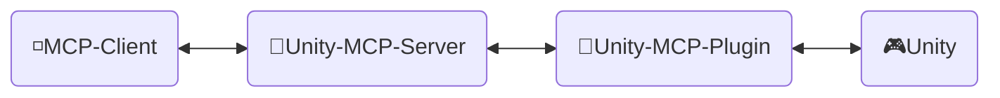
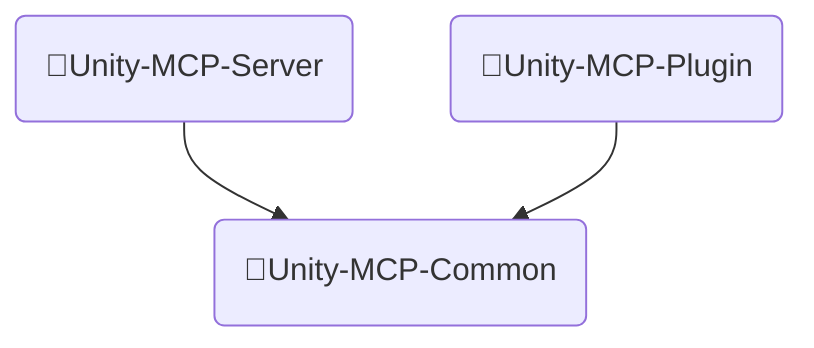
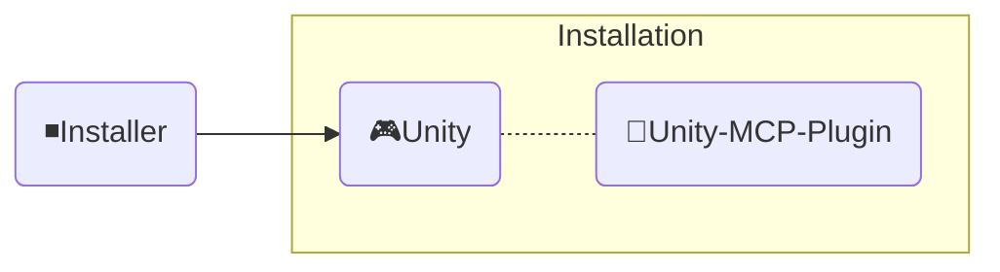

<div align="center" width="100%">
  <h1>🛠️ 开发文档 ─ AI 游戏开发者</h1>

[](https://modelcontextprotocol.io/introduction)
[](https://openupm.com/packages/com.ivanmurzak.unity.mcp/)
[](https://hub.docker.com/r/ivanmurzakdev/unity-mcp-server)
[](https://unity.com/releases/editor/archive)
[](https://unity.com/releases/editor/archive)
[](https://github.com/IvanMurzak/Unity-MCP/actions/workflows/release.yml)</br>
[](https://discord.gg/cfbdMZX99G)
[](https://github.com/IvanMurzak/Unity-MCP/stargazers)
[](https://github.com/IvanMurzak/Unity-MCP/blob/main/LICENSE)
[](https://stand-with-ukraine.pp.ua)

  <b>[English](https://github.com/IvanMurzak/Unity-MCP/blob/main/docs/dev/Development.md) | [Español](https://github.com/IvanMurzak/Unity-MCP/blob/main/docs/dev/Development.es.md) | [日本語](https://github.com/IvanMurzak/Unity-MCP/blob/main/docs/dev/Development.ja.md)</b>

</div>

**愿景**

我们相信 AI 将会是(如果还不是的话)游戏开发的重要组成部分。目前有很多令人惊叹的 AI 界面,例如 `Claude`、`Copilot`、`Cursor` 等等。它们提供了出色的代理和功能,最重要的是 - 它们在不断改进。这些项目拥有庞大的预算,可能会成为专业人士最好的 AI 平台。我们将游戏开发与这些工具连接起来,本项目与它们协同工作,而非对抗。我们将与它们一起成长。这就是为什么本项目不会实现内部独立的聊天窗口。我们希望构建简单而优雅的解决方案,成为 Unity Engine 生态系统中游戏开发 AI 系统的基础。

**项目目标**

- 向所有人**免费**提供高质量的 AI 游戏开发解决方案
- 为游戏开发者提供高度可定制的平台,以根据他们的需求定制 AI 功能
- 允许在一个地方使用最好的 AI 工具进行游戏开发
- 维护和支持游戏开发的前沿 AI 技术,特别是在 Unity Engine 及引擎之外

**贡献**

任何对项目的贡献都非常感谢。请遵循本文档查看我们的目标、愿景和项目结构。所有这些都将帮助您参与到游戏开发的新技术时代中。

**本文档**

本文档解释了项目内部结构、设计、代码风格和主要原则。如果您是贡献者或想深入了解项目,请使用本文档。

> **[💬 加入我们的 Discord 服务器](https://discord.gg/cfbdMZX99G)** - 提问、展示您的作品,并与其他开发者交流!

## 目录

- [贡献](#贡献)
- [项目结构](#项目结构)
  - [🔹Unity-MCP-Server](#unity-mcp-server)
    - [Docker 镜像](#docker-镜像)
  - [🔸Unity-MCP-Plugin](#unity-mcp-plugin)
    - [UPM 包](#upm-包)
    - [Editor](#editor)
    - [Runtime](#runtime)
    - [MCP 功能](#mcp-功能)
      - [添加 `MCP Tool`](#添加-mcp-tool)
      - [添加 `MCP Prompt`](#添加-mcp-prompt)
  - [🔺Unity-MCP-Common](#unity-mcp-common)
  - [◾Installer (Unity)](#installer-unity)
- [代码风格](#代码风格)
- [CI/CD](#cicd)
  - [工作流概述](#工作流概述)
    - [🚀 release.yml](#-releaseyml)
    - [🧪 test\_pull\_request.yml](#-test_pull_requestyml)
    - [🔧 test\_unity\_plugin.yml](#-test_unity_pluginyml)
    - [📦 deploy.yml](#-deployyml)
    - [🎯 deploy\_server\_executables.yml](#-deploy_server_executablesyml)
  - [技术栈](#技术栈)
  - [安全考虑](#安全考虑)
  - [部署目标](#部署目标)

# 贡献

让我们一起构建光明的游戏开发未来,为项目做出贡献。使用本文档了解项目结构及其确切工作方式。

1. [Fork 项目](https://github.com/IvanMurzak/Unity-MCP/fork)
2. 进行改进,遵循代码风格
3. [创建 Pull Request](https://github.com/IvanMurzak/Unity-MCP/compare)

# 项目结构



◽**MCP Client** - 任何 AI 界面,例如:*Claude*、*Copilot*、*Cursor* 或其他,它不是这些项目的一部分,但它是架构的重要元素。

🔹**Unity-MCP-Server** - 连接到 `MCP Client` 并与其交互的 `MCP Server`。同时 `Unity-MCP-Server` 通过 SignalR 与 `Unity-MCP-Plugin` 通信。可以在本地运行或在云端使用 HTTP 传输。技术栈:`C#`、`ASP.NET Core`、`SignalR`

🔸**Unity-MCP-Plugin** - 集成到 Unity 项目中的 `Unity Plugin`,可以访问 Unity 的 API。与 `Unity-MCP-Server` 通信并执行来自服务器的命令。技术栈:`C#`、`Unity`、`SignalR`

🎮**Unity** - Unity 引擎,游戏引擎。

---

## 🔹Unity-MCP-Server

一个 C# ASP.NET Core 应用程序,充当 MCP 客户端(如 Claude、Cursor 等 AI 界面)和 Unity Editor 实例之间的桥梁。该服务器使用 [csharp-sdk](https://github.com/modelcontextprotocol/csharp-sdk) 实现 [Model Context Protocol](https://github.com/modelcontextprotocol)。

> 项目位置:`Unity-MCP-Server`

**主要职责:**

1. **MCP 协议实现** ([ExtensionsMcpServer.cs](Unity-MCP-Server/src/Extension/ExtensionsMcpServer.cs))
   - 实现支持 Tools、Prompts 和 Resources 的 MCP 服务器
   - 支持 STDIO 和 HTTP 传输方法
   - 处理 MCP 客户端请求:`CallTool`、`GetPrompt`、`ReadResource` 及其列表操作
   - 当能力发生变化时向 MCP 客户端发送通知(工具/提示列表更新)

2. **SignalR Hub 通信** ([RemoteApp.cs](Unity-MCP-Server/src/Hub/RemoteApp.cs), [BaseHub.cs](Unity-MCP-Server/src/Hub/BaseHub.cs))
   - 通过 SignalR 管理与 Unity-MCP-Plugin 的实时双向通信
   - 处理版本握手以确保服务器和插件之间的 API 兼容性
   - 跟踪客户端连接并管理断开连接
   - 将来自 Unity 的工具/提示/资源更新通知路由到 MCP 客户端

3. **请求路由与执行** ([ToolRouter.Call.cs](Unity-MCP-Server/src/Routing/Tool/ToolRouter.Call.cs), [PromptRouter.Get.cs](Unity-MCP-Server/src/Routing/Prompt/PromptRouter.Get.cs), [ResourceRouter.ReadResource.cs](Unity-MCP-Server/src/Routing/Resource/ResourceRouter.ReadResource.cs))
   - 将 MCP 客户端请求路由到适当的 Unity-MCP-Plugin 实例
   - 处理 Tool 调用、Prompt 请求和 Resource 读取
   - 执行错误处理和验证
   - 在 MCP 协议格式和内部数据模型之间转换

4. **远程执行服务** ([RemoteToolRunner.cs](Unity-MCP-Server/src/Client/RemoteToolRunner.cs), [RemotePromptRunner.cs](Unity-MCP-Server/src/Client/RemotePromptRunner.cs), [RemoteResourceRunner.cs](Unity-MCP-Server/src/Client/RemoteResourceRunner.cs))
   - 通过 SignalR 在 Unity-MCP-Plugin 上调用远程过程
   - 跟踪异步请求并管理超时
   - 实现支持取消的请求/响应模式
   - 处理来自 Unity 实例的请求完成回调

5. **服务器生命周期管理** ([Program.cs](Unity-MCP-Server/src/Program.cs), [McpServerService.cs](Unity-MCP-Server/src/McpServerService.cs))
   - 使用 Kestrel 配置和启动 ASP.NET Core Web 服务器
   - 初始化 MCP 服务器、SignalR hub 和依赖注入
   - 使用 NLog 管理日志记录(在 STDIO 模式下将日志重定向到 stderr)
   - 处理优雅关闭和资源清理
   - 订阅 Unity 工具/提示列表更改事件

### Docker 镜像

`Unity-MCP-Server` 可以部署到 Docker 镜像。它在项目文件夹中包含 `Dockerfile` 和 `.dockerignore` 文件。

---

## 🔸Unity-MCP-Plugin

集成到 Unity 环境中。使用 `Unity-MCP-Common` 通过反射在本地代码库中搜索 MCP *Tool*、*Resource* 和 *Prompt*。与 `Unity-MCP-Server` 通信以发送有关 MCP *Tool*、*Resource* 和 *Prompt* 的更新。接收来自 `Unity-MCP-Server` 的命令并执行。

> 项目位置:`Unity-MCP-Plugin`

### UPM 包

`Unity-MCP-Plugin` 是一个 UPM 包,包的根文件夹位于 `Unity-MCP-Plugin/Assets/root`。它包含 `package.json`,用于直接从 GitHub release 上传包到 [OpenUPM](https://openupm.com/)。

> 位置 `Unity-MCP-Plugin/Assets/root`

### Editor

Editor 组件提供 Unity Editor 集成,实现 MCP 功能(Tools、Prompts、Resources)并管理 `Unity-MCP-Server` 生命周期。

> 位置 `Unity-MCP-Plugin/Assets/root/Editor`

**主要职责:**

1. **插件生命周期管理** ([Startup.cs](../../Unity-MCP-Plugin/Assets/root/Editor/Scripts/Startup.cs))
   - 通过 `[InitializeOnLoad]` 在 Unity Editor 加载时自动初始化
   - 管理 Editor 生命周期事件(程序集重新加载、播放模式转换)期间的连接持久性
   - 在域重新加载或退出播放模式后自动重新连接

2. **MCP Server 二进制文件管理** ([Startup.Server.cs](../../Unity-MCP-Plugin/Assets/root/Editor/Scripts/Startup.Server.cs))
   - 从 GitHub releases 下载和管理 `Unity-MCP-Server` 可执行文件
   - 跨平台二进制文件选择(Windows/macOS/Linux, x86/x64/ARM/ARM64)
   - 强制执行服务器和插件之间的版本兼容性
   - 为 MCP 客户端生成配置(包含可执行文件路径和连接设置的 JSON)

3. **MCP API 实现** ([Scripts/API/](../../Unity-MCP-Plugin/Assets/root/Editor/Scripts/API/))
   - **Tools**(50+):GameObject、Scene、Assets、Prefabs、Scripts、Components、Editor Control、Test Runner、Console、Reflection
   - **Prompts**:常见 Unity 开发任务的预构建模板
   - **Resources**:基于 URI 访问 Unity Editor 数据并进行 JSON 序列化
   - 所有操作都在 Unity 的主线程上执行以保证线程安全
   - 使用 `[McpPluginTool]`、`[McpPluginPrompt]`、`[McpPluginResource]` 基于属性的发现

4. **Editor UI** ([Scripts/UI/](../../Unity-MCP-Plugin/Assets/root/Editor/Scripts/UI/))
   - 连接管理的配置窗口(`Window > AI Game Developer`)
   - 通过 Unity 菜单项进行服务器二进制文件管理和日志访问

### Runtime

Runtime 组件提供在 Editor 和 Runtime 模式之间共享的核心基础设施,处理 SignalR 通信、序列化和线程安全的 Unity API 访问。

> 位置 `Unity-MCP-Plugin/Assets/root/Runtime`

**主要职责:**

1. **插件核心与 SignalR 连接** ([UnityMcpPlugin.cs](../../Unity-MCP-Plugin/Assets/root/Runtime/UnityMcpPlugin.cs))
   - 通过 `BuildAndStart()` 管理插件生命周期的线程安全单例
   - 使用反射从程序集中发现 MCP Tools/Prompts/Resources
   - 建立与 Unity-MCP-Server 的 SignalR 连接,并使用响应式状态监控(R3 库)
   - 配置管理:主机、端口、超时、版本兼容性

2. **主线程调度器** ([MainThreadDispatcher.cs](../../Unity-MCP-Plugin/Assets/root/Runtime/Utils/MainThreadDispatcher.cs))
   - 将来自 SignalR 后台线程的 Unity API 调用编组到 Unity 的主线程
   - 在 Unity 的 Update 循环中基于队列的执行
   - 对于线程安全的 MCP 操作执行至关重要

3. **Unity 类型序列化** ([ReflectionConverters/](../../Unity-MCP-Plugin/Assets/root/Runtime/ReflectionConverters/), [JsonConverters/](../../Unity-MCP-Plugin/Assets/root/Runtime/JsonConverters/))
   - Unity 类型的自定义 JSON 序列化(GameObject、Component、Transform、Vector3、Quaternion 等)
   - 将 Unity 对象转换为引用格式(`GameObjectRef`、`ComponentRef`),并使用 instanceID 跟踪
   - 与 ReflectorNet 集成进行对象内省和组件序列化
   - 为 MCP 协议类型定义提供 JSON schemas

4. **日志与诊断** ([Logger/](../../Unity-MCP-Plugin/Assets/root/Runtime/Logger/), [Unity/Logs/](../../Unity-MCP-Plugin/Assets/root/Runtime/Unity/Logs/))
   - 将 Microsoft.Extensions.Logging 桥接到带有颜色编码级别的 Unity Console
   - 收集 Unity Console 日志,通过 MCP Tools 进行 AI 上下文检索

### MCP 功能

#### 添加 `MCP Tool`

```csharp
[McpPluginToolType]
public class Tool_GameObject
{
    [McpPluginTool
    (
        "MyCustomTask",
        Title = "Create a new GameObject"
    )]
    [Description("Explain here to LLM what is this, when it should be called.")]
    public string CustomTask
    (
        [Description("Explain to LLM what is this.")]
        string inputData
    )
    {
        // do anything in background thread

        return MainThread.Instance.Run(() =>
        {
            // do something in main thread if needed

            return $"[Success] Operation completed.";
        });
    }
}
```

#### 添加 `MCP Prompt`

`MCP Prompt` 允许您将自定义提示注入到与 LLM 的对话中。它支持两种发送者角色:User 和 Assistant。这是指示 LLM 执行特定任务的快速方法。您可以使用自定义数据生成提示,提供列表或任何其他相关信息。

```csharp
[McpPluginPromptType]
public static class Prompt_ScriptingCode
{
    [McpPluginPrompt(Name = "add-event-system", Role = Role.User)]
    [Description("Implement UnityEvent-based communication system between GameObjects.")]
    public string AddEventSystem()
    {
        return "Create event system using UnityEvents, UnityActions, or custom event delegates for decoupled communication between game systems and components.";
    }
}
```

---

## 🔺Unity-MCP-Common



**Unity-MCP-Common** - `Unity-MCP-Server` 和 `Unity-MCP-Plugin` 之间的共享代码库。它用于简化项目之间的数据模型和 API 共享。它是一个独立的 dotnet 库项目。

> 项目位置:`Unity-MCP-Plugin/Assets/root/Unity-MCP-Common`

---

## ◾Installer (Unity)



**Installer** 将 `Unity-MCP-Plugin` 和依赖项作为 NPM 包安装到 Unity 项目中。

> 项目位置:`Installer`

---

# 代码风格

本项目遵循一致的 C# 编码模式。以下是演示关键约定的综合示例:

```csharp
/*
┌──────────────────────────────────────────────────────────────────┐
│  Author: Ivan Murzak (https://github.com/IvanMurzak)             │
│  Repository: GitHub (https://github.com/IvanMurzak/Unity-MCP)    │
│  Copyright (c) 2025 Ivan Murzak                                  │
│  Licensed under the Apache License, Version 2.0.                 │
│  See the LICENSE file in the project root for more information.  │
└──────────────────────────────────────────────────────────────────┘
*/

// 启用可空引用类型以获得更好的空值安全性
#nullable enable

// 平台特定代码的条件编译
#if UNITY_EDITOR
using UnityEditor;
#endif

using System;
using System.ComponentModel;
using System.Threading.Tasks;
using com.IvanMurzak.Unity.MCP.Common;
using com.IvanMurzak.Unity.MCP.Utils;
using UnityEngine;

namespace com.IvanMurzak.Unity.MCP.Editor.API
{
    // 对工具类使用 [McpPluginToolType] - 通过反射启用 MCP 发现
    [McpPluginToolType]
    // 部分类允许跨多个文件拆分实现
    // 模式:每个操作一个文件(例如 GameObject.Create.cs, GameObject.Destroy.cs)
    public partial class Tool_GameObject
    {
        // 嵌套的 Error 类集中错误消息以便于维护
        public static class Error
        {
            // 静态方法用于一致的错误格式化
            public static string GameObjectNameIsEmpty()
                => "[Error] GameObject name is empty. Please provide a valid name.";

            public static string NotFoundGameObjectAtPath(string path)
                => $"[Error] GameObject '{path}' not found.";
        }

        // 使用基于属性的元数据声明 MCP Tool
        [McpPluginTool(
            "GameObject_Create",                    // 唯一的工具标识符
            Title = "Create a new GameObject"       // 人类可读的标题
        )]
        // Description 属性指导 AI 何时/如何使用此工具
        [Description(@"Create a new GameObject in the scene.
Provide position, rotation, and scale to minimize subsequent operations.")]
        public string Create
        (
            // 参数描述帮助 AI 理解预期的输入
            [Description("Name of the new GameObject.")]
            string name,

            [Description("Parent GameObject reference. If not provided, created at scene root.")]
            GameObjectRef? parentGameObjectRef = null,  // 可空,带默认值

            [Description("Transform position of the GameObject.")]
            Vector3? position = null,                    // Unity 结构体,可空

            [Description("Transform rotation in Euler angles (degrees).")]
            Vector3? rotation = null,

            [Description("Transform scale of the GameObject.")]
            Vector3? scale = null
        )
        // Lambda 表达式语法用于立即主线程执行
        => MainThread.Instance.Run(() =>           // 所有 Unity API 调用必须在主线程上运行
        {
            // 尽早验证输入参数
            if (string.IsNullOrEmpty(name))
                return Error.GameObjectNameIsEmpty();

            // 默认值的空值合并赋值
            position ??= Vector3.zero;
            rotation ??= Vector3.zero;
            scale ??= Vector3.one;

            // 使用 Unity API 创建 GameObject
            var go = new GameObject(name);

            // 如果提供了父对象则设置
            if (parentGameObjectRef?.IsValid ?? false)
            {
                var parentGo = parentGameObjectRef.FindGameObject(out var error);
                if (error != null)
                    return $"[Error] {error}";

                go.transform.SetParent(parentGo.transform, worldPositionStays: false);
            }

            // 应用变换值
            go.transform.localPosition = position.Value;
            go.transform.localRotation = Quaternion.Euler(rotation.Value);
            go.transform.localScale = scale.Value;

            // 标记为已修改以供 Unity Editor 使用
            EditorUtility.SetDirty(go);

            // 返回带有结构化数据的成功消息
            // 使用字符串插值以获得可读的格式
            return $"[Success] Created GameObject.\ninstanceID: {go.GetInstanceID()}, path: {go.GetPath()}";
        });

        // 具有适当错误处理的异步方法示例
        public static async Task<string> AsyncOperation(string parameter)
        {
            try
            {
                // 后台工作可以在这里进行
                await Task.Delay(100);

                // 切换到主线程进行 Unity API 调用
                return await MainThread.Instance.RunAsync(() =>
                {
                    // Unity API 调用在这里
                    return "[Success] Async operation completed.";
                });
            }
            catch (Exception ex)
            {
                // 使用结构化日志记录异常
                Debug.LogException(ex);
                return $"[Error] Operation failed: {ex.Message}";
            }
        }
    }

    // 用于提示的单独部分类文件
    [McpPluginPromptType]
    public static partial class Prompt_SceneManagement
    {
        // 带有角色定义(User 或 Assistant)的 MCP Prompt
        [McpPluginPrompt(Name = "setup-basic-scene", Role = Role.User)]
        [Description("Setup a basic scene with camera, lighting, and environment.")]
        public static string SetupBasicScene()
        {
            // 返回提示文本供 AI 处理
            return "Create a basic Unity scene with Main Camera, Directional Light, and basic environment setup.";
        }
    }
}
```

**关键约定:**

1. **文件头**:在方框注释格式中包含版权声明
2. **可空上下文**:使用 `#nullable enable` 实现空值安全
3. **属性**:利用 `[McpPluginTool]`、`[McpPluginPrompt]`、`[McpPluginResource]` 进行 MCP 发现
4. **部分类**:跨文件拆分功能(例如 `Tool_GameObject.Create.cs`)
5. **主线程执行**:使用 `MainThread.Instance.Run()` 包装 Unity API 调用
6. **错误处理**:在嵌套的 `Error` 类中集中错误消息
7. **返回格式**:在返回字符串中使用 `[Success]` 或 `[Error]` 前缀
8. **描述**:使用 `[Description]` 为 AI 指导注释所有公共 API
9. **命名**:公共成员使用 PascalCase,私有/本地使用 camelCase
10. **空值安全**:使用可空类型(`?`)和空值合并运算符(`??`、`??=`)

---

# CI/CD

项目使用 GitHub Actions 实现了全面的 CI/CD 管道,多个工作流协调构建、测试和部署过程。

## 工作流概述

> 位置:`.github/workflows`

### 🚀 [release.yml](../../.github/workflows/release.yml)

**触发器:** 推送到 `main` 分支
**目的:** 协调整个发布过程的主要发布工作流

**流程:**

1. **版本检查** - 从 [package.json](../../Unity-MCP-Plugin/Assets/root/package.json) 提取版本并检查发布标签是否已存在
2. **构建 Unity 安装器** - 测试并导出 Unity 包安装器(`AI-Game-Dev-Installer.unitypackage`)
3. **构建 MCP Server** - 使用 [build-all.sh](../../Unity-MCP-Server/build-all.sh) 编译跨平台可执行文件(Windows、macOS、Linux)
4. **Unity 插件测试** - 运行全面测试:
   - 3 个 Unity 版本:`2022.3.61f1`、`2023.2.20f1`、`6000.3.1f1`
   - 3 种测试模式:`editmode`、`playmode`、`standalone`
   - 2 个操作系统:`windows-latest`、`ubuntu-latest`
   - 总计:**18 个测试矩阵组合**
5. **创建发布** - 从提交生成发布说明并创建带标签的 GitHub release
6. **发布** - 将 Unity 安装器包和 MCP Server 可执行文件上传到 release
7. **Discord 通知** - 将格式化的发布说明发送到 Discord 频道
8. **部署** - 触发 NuGet 和 Docker 的部署工作流
9. **清理** - 成功发布后删除构建工件

### 🧪 [test_pull_request.yml](../../.github/workflows/test_pull_request.yml)

**触发器:** 拉取请求到 `main` 或 `dev` 分支
**目的:** 在合并之前验证 PR 更改

**流程:**

1. 为所有平台构建 MCP Server 可执行文件
2. 运行与发布工作流相同的 18 个 Unity 测试矩阵组合
3. 所有测试必须通过才能合并 PR

### 🔧 [test_unity_plugin.yml](../../.github/workflows/test_unity_plugin.yml)

**类型:** 可重用工作流
**目的:** 发布和 PR 工作流使用的参数化 Unity 测试工作流

**功能:**

- 接受参数:`projectPath`、`unityVersion`、`testMode`
- 在操作系统矩阵(Windows、Ubuntu)上运行
- 使用带有自定义 Docker 镜像的 Game CI Unity Test Runner
- 为 PR 贡献者实施安全检查(不受信任的 PR 需要 `ci-ok` 标签)
- 如果在 PR 中修改了工作流文件则中止
- 缓存 Unity Library 以加快后续运行
- 上传测试工件以进行调试

### 📦 [deploy.yml](../../.github/workflows/deploy.yml)

**触发器:** 由发布工作流调用 OR 手动调度 OR 在发布发布时
**目的:** 将 MCP Server 部署到 NuGet 和 Docker Hub

**作业:**

**1. 部署到 NuGet:**

- 构建和测试 MCP Server
- 打包 NuGet 包
- 发布到 [nuget.org](https://www.nuget.org/packages/com.IvanMurzak.Unity.MCP.Server)

**2. 部署 Docker 镜像:**

- 构建多平台 Docker 镜像(linux/amd64, linux/arm64)
- 推送到 [Docker Hub](https://hub.docker.com/r/ivanmurzakdev/unity-mcp-server)
- 使用版本号和 `latest` 标签
- 使用 GitHub Actions 缓存进行构建优化

### 🎯 [deploy_server_executables.yml](../../.github/workflows/deploy_server_executables.yml)

**触发器:** GitHub release 发布
**目的:** 构建跨平台服务器可执行文件并上传到 release

**流程:**

- 在 macOS 上运行以支持交叉编译
- 使用 [build-all.sh](../../Unity-MCP-Server/build-all.sh) 为 Windows、macOS、Linux 构建可执行文件
- 为每个平台创建 ZIP 存档
- 上传到 GitHub release

## 技术栈

- **CI 平台:** GitHub Actions
- **Unity 测试:** 使用 Unity Test Runner 的 [Game CI](https://game.ci/)
- **容器化:** 具有多平台构建的 Docker
- **包管理:** NuGet、OpenUPM、Docker Hub
- **构建工具:** .NET 9.0、bash 脚本
- **工件存储:** GitHub Actions 工件(临时)、GitHub Releases(永久)

## 安全考虑

- Unity 许可证、电子邮件和密码作为 GitHub secrets 存储
- NuGet API 密钥和 Docker 凭据受保护
- PR 工作流包括工作流文件修改的安全检查
- 不受信任的 PR 贡献需要通过 `ci-ok` 标签获得维护者批准

## 部署目标

1. **GitHub Releases** - Unity 安装器包和 MCP Server 可执行文件
2. **NuGet** - 面向 .NET 开发者的 MCP Server 包
3. **Docker Hub** - 用于云部署的容器化 MCP Server
4. **OpenUPM** - Unity 插件包(自动从 GitHub releases 同步)
